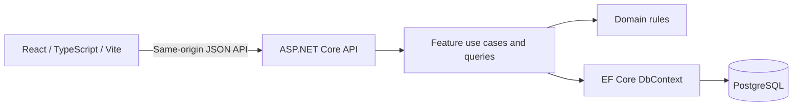

# ServiceOps — Architecture

Status: Phases 1–6 accepted. Final portfolio polish is implemented and awaiting review. Priority changes, notes and the SLA background worker are intentionally outside the completed portfolio scope.

Prepared: September 28, 2026. Organization: Atlas Facility Services.

Revised: October 6, 2026. The objective is a polished, credible portfolio application demonstrating senior engineering judgment, not a production replacement for a commercial field-service platform.

## 1. Purpose and scope

ServiceOps is an internal operations system for creating, assigning, tracking, and resolving facility-service work orders. Managers additionally receive operational and SLA reporting. The central engineering challenge is keeping workflow, deadlines, audit history, and dashboard drill-throughs consistent while presenting a dense but usable interface.

Build one React application, one ASP.NET Core API, and one PostgreSQL database. Use a modular monolith with feature-oriented application code, an explicit domain boundary, and direct EF Core persistence. The expected 150 locations and 400–500 demo work orders do not warrant distributed services, a warehouse, a message broker, or a separate read database.

Billing, payments, customer portals, technician mobile applications, SMS, mapping, inventory, multi-tenancy, complex permissions, and dispatch optimization remain outside scope. AWS topology and provisioning are deferred.

## 2. Decisions and working assumptions

The review decisions are incorporated below. Unchanged business defaults remain documented assumptions. This document describes the implemented portfolio application; exclusions are deliberate, not pending deliverables.

| Topic | Implemented decision and consequence |
| --- | --- |
| SLA meaning | Time to completed resolution, not acknowledgment or first response. Critical priority has a two-hour resolution target. |
| Calendar | Continuous elapsed time, 24/7, including holidays. No business-hours calendar or pause while waiting. |
| Workflow | New, Assigned, InProgress, OnHold, Completed, Cancelled. The first four are open. |
| Assignment | One optional technician per order. Technicians are workforce records, not necessarily login users. No availability or skill-matching engine. |
| Completion | Requires an assigned technician and a short resolution summary. Completed and Cancelled are terminal; follow-up work gets a new order. |
| Changes after creation | Title and description may change while open. Customer, location, service type and priority remain immutable. Priority changes and SLA recalculation are deferred indefinitely. |
| Notes and history | Append-only activity records assignment, corrections and workflow. Notes are deferred indefinitely. No activity editing, attachments or rich text. |
| Identity | ASP.NET Core Identity and two server-enforced roles: Operations and Manager, with seeded demo users for each. Registration, account administration, password-reset UI, SSO, and complex authorization are outside scope. |
| Time zone | The dashboard uses the fixed America/New_York reporting calendar; UTC storage throughout. No timezone administration UI. |
| Scale | The fictional business has roughly 150 locations; the initial 50-location seed is a representative subset, not its complete estate. |
| Reference data | Customers, locations, and technicians are seeded/read-only initially; administration screens are outside the requested workflow. Inactive records remain available on historical orders. |

Retain 24/7 resolution-based SLAs and terminal Completed/Cancelled statuses. Priority remains immutable; reopening remains outside scope. Current Operations and Period Performance remain distinct dashboard concepts.

## 3. Application architecture and technology



The backend uses .NET SDK 10.0.401, ASP.NET Core/EF Core 10.0.12 and Npgsql EF Core 10.0.3. SDK and package versions are pinned in global.json and project/lock files.

The local configuration targets PostgreSQL 18.6. Real PostgreSQL integration tests exercise provider translation, transactions and constraints. Container images use explicit version tags.

HTTP endpoints validate transport input and invoke small, concrete use cases. Domain methods own status transitions and deadline rules. Feature controllers project directly to response DTOs with no tracking. EF Core handles persistence and transactions; do not wrap it in a generic repository. Avoid MediatR, a generic unit-of-work layer, event sourcing, and speculative service interfaces. Introduce an interface only at a real boundary, such as current-user access; use .NET TimeProvider for time.

Explicit exclusions: no microservices, generic repositories, MediatR, generic unit-of-work abstractions, Redis, message brokers, or event sourcing. Keep feature-oriented application code and explicit domain rules as the primary organizing mechanisms.

Work-order changes and their audit entries commit in one database transaction. Domain entities never become API response objects. OpenAPI defines the HTTP contract and generates frontend TypeScript types. CI checks for stale generated contracts.

## 4. Implemented backend structure

The API owns HTTP transport, Identity and EF persistence; Domain owns business operations.

```text
backend/
  ServiceOps.sln
  src/
    ServiceOps.Domain/
      WorkOrders/       # Aggregate, statuses, priorities, SLA rules
      Customers/        # Customer and location entities
      Technicians/
    ServiceOps.Api/
      Features/
        WorkOrders/    # Create, edit, assign, transition, list, detail
        Dashboard/     # Metric definitions and aggregate queries
        ReferenceData/
        Auth/          # Identity endpoints and role policies
      Persistence/
        ServiceOpsDbContext.cs
        Configurations/
        Migrations/
        Seeding/
      Identity/        # ApplicationUser
      Program.cs
  tests/
    ServiceOps.Domain.Tests/
    ServiceOps.Api.IntegrationTests/
```

Dependency direction: API references Domain; Domain references no ASP.NET Core or EF Core packages. Tests reference their subjects. Domain audit actor IDs are scalar identifiers; the Identity implementation stays in API. Features and persistence share one assembly intentionally. No worker or separate infrastructure project is present.

## 5. Implemented frontend structure and UI stack

```text
frontend/
  src/
    app/                # Router, providers, layout, theme
    features/
      auth/
      dashboard/        # Current workload and completion-period summaries
      work-orders/      # List, create form, detail, workflow actions
    lib/
      api/              # Fetch client, generated contract, errors
    styles.css
```

The frontend uses Material UI Core and MUI X Data Grid Community. Their visual consistency and table capabilities suit an internal operations platform. Community is MIT-licensed; advanced grid capabilities have commercial tiers. Use a dedicated business-filter toolbar and server-side filtering, single-column sorting, and page sizes of 25, 50, or 100. Do not depend on Pro multi-sort, grid multi-filter UI, or paid export features. Revisit licensing only if those become actual requirements. [MUI grid](https://mui.com/x/react-data-grid), [licensing](https://mui.com/x/introduction/licensing/).

Use existing Material UI cards, status summaries and workload bars for the focused dashboard. No charting dependency is needed. Trends, created-cohort charts and attention tables are outside the completed portfolio scope.

React Router handles navigation, TanStack Query owns server state, and local React form state plus explicit validation handles forms. React Hook Form and Zod are not dependencies. Dashboard, queue, creation and detail use React.lazy route chunks with one Suspense loading state inside the persistent shell. Local React state handles dialogs and tabs; URL parameters own filters, sort, pagination, and detail tabs. No Redux. API validation remains authoritative. TanStack Query provides the server-state caching/invalidation model: [documentation](https://tanstack.com/query/latest/docs/framework/react/overview). React 19.3, TypeScript 5.9, Vite 8.3 and Node 24 are pinned by repository configuration and lockfiles.

UI direction: restrained Atlas branding, compact spacing, readable typography, persistent navigation, clear page titles, visible filter chips, and consistent status/priority/SLA badges. Dashboard separates current backlog/SLA/workload from completion-period outcomes and compliance. Detail is a full route with Overview and Activity tabs. Creation uses a full-page form for tablet usability.

Customer changes clear the selected location. Disable location selection until a customer is chosen. Label every control, return focus after dialogs, expose errors inline, and announce save results. Use text/icons alongside color. Support keyboard navigation, reduced motion, sensible touch targets, and desktop/tablet layouts. Tables may scroll horizontally; important identity and action columns stay discoverable.

Provide skeletons for initial loading, preserved rows plus a refresh indicator for subsequent fetches, distinct empty-dataset and no-filter-results states, retryable error panels, and unauthorized/not-found routes. Invalidate detail, lists, activity, and dashboard after successful mutations. Refetch time-sensitive views every 60 seconds while visible and on focus; show the server's evaluation timestamp.

## 6. Domain model and relationships

Use UUID primary keys. Work orders also receive a database-sequence-backed human number, e.g. WO-10482, with a unique constraint; gaps are acceptable. Do not generate numbers with row counts.

| Entity | Main attributes and invariants |
| --- | --- |
| Customer | Id, Name, Code (unique), IsActive. Owns many locations. |
| Location | Id, CustomerId, Name, Code, address fields, IsActive. Code unique within customer; customer ownership cannot change after use. |
| Technician | Id, DisplayName, Email, IsActive. Can be assigned many orders; deactivation does not rewrite history. |
| ApplicationUser | ASP.NET Core Identity user with UUID ID, display name, active flag, and role membership. Owns authored actions. |
| WorkOrder | Id, Number, LocationId, TechnicianId nullable, Title, Description, ServiceType, Priority, Status, CreatedAt, CreatedByUserId, UpdatedAt, SlaPolicyVersion, SlaDurationMinutes, SlaAtRiskAt, SlaDeadlineAt, SlaRevision, CompletedAt nullable, CancelledAt nullable, ResolutionSummary nullable, CancellationReason nullable, HoldReason nullable, Revision. SlaRevision remains unchanged while priority changes and monitoring are deferred; Revision protects business mutations. |
| WorkOrderActivity | Id, WorkOrderId, ActorUserId, EventType, EffectiveAt, RecordedAt, structured before/after payload. System observations are deferred. Append-only. |

Customer has many Locations; Location has many WorkOrders; Technician optionally has many WorkOrders; WorkOrder has many Activities; User has many authored Activities. WorkOrder reaches Customer through Location, avoiding contradictory CustomerId/LocationId pairs. Creation still accepts both IDs and validates their relationship. Historical customer/location display uses current reference names; full historical name snapshots are not required initially.

ServiceType is a closed enum: HVAC, Electrical, Plumbing, Equipment, GeneralMaintenance. Priority and Status are closed enums as well. Persist readable values with database constraints and serialize stable string codes; UI labels are separate. WorkOrder is the write consistency boundary; do not eagerly load its entire activity history.

Workflow rules:

- New -> Assigned when a technician is assigned; New -> Cancelled with a reason.
- Assigned -> New when unassigned; Assigned -> InProgress or Cancelled.
- InProgress -> OnHold, Completed, or Cancelled.
- OnHold -> InProgress, Completed, or Cancelled; entering OnHold requires a reason.
- Assigned, InProgress, and OnHold require an active technician on new assignments. Reassignment is allowed while open; unassignment after work starts is rejected.
- Completed and Cancelled have no outgoing transitions. Completion sets its timestamp once; cancellation records a reason and timestamp. Neither is counted as open.

Database constraints enforce required text, positive SLA duration, ordered SLA timestamps, valid terminal timestamps, unique numbers, and foreign keys. Use restrictive deletion; deactivate reference records instead. Apply explicit maximum lengths (title 200, description 10,000, workflow reasons/summaries 5,000 characters) and normalize surrounding whitespace.

Use an application-managed numeric Revision as an EF concurrency token and return it in response bodies. Mutation bodies may include expectedRevision; the frontend supplies it for edits, assignment, and status transitions. If it differs from the stored revision, return 409 Conflict with errorCode `stale_revision` and a clear reload-and-review message. Increment Revision on successful business changes and translate EF concurrency failures to the same response. Without expectedRevision, validate against the current loaded state; EF still detects changes between load and save, but cannot detect an earlier stale client view. Do not implement ETag/If-Match or 412/428 precondition handling. Audit JSON contains known event fields, not arbitrary entity dumps.

Implemented indexes include unique work-order Number, foreign-key indexes and (WorkOrderId, EffectiveAt, Id) on activity, alongside reference-data uniqueness. Queue and dashboard aggregates were measured against 450 orders; no speculative reporting/filter indexes were added. Parameterized case-insensitive title/number search and offset pagination suit this dataset.

## 7. API contract

Use JSON under `/api/v1`, camelCase fields, ISO 8601 UTC timestamps, and explicit request/response DTOs. Business endpoints require authentication. Login, antiforgery-token acquisition and limited health checks are anonymous; OpenAPI is exposed only in Development. Manager policy protects dashboard endpoints; operations mutations permit both roles. The client never supplies an authoritative actor, creation timestamp, or SLA deadline.

| Method and route | Behavior |
| --- | --- |
| POST /auth/login; POST /auth/logout; GET /auth/me | Session lifecycle and current user/roles. |
| GET /auth/csrf | Obtain the antiforgery request token for cookie-authenticated mutations. |
| GET /customers | Active customer selection records. |
| GET /customers/{id}/locations | Dependent location lookup. |
| GET /technicians | Technician filter/assignment lookup. |
| GET /reference-data | Enum codes and display labels. |
| GET /work-orders | Filtered, sorted, paginated summaries. |
| POST /work-orders | Create; return 201, Location header, and detail including revision. |
| GET /work-orders/{id} | Detail plus computed SLA fields and revision. |
| PATCH /work-orders/{id} | Whitelisted title/description correction; optional expectedRevision. |
| PUT /work-orders/{id}/assignment | Set technicianId or null using workflow rules; optional expectedRevision. |
| POST /work-orders/{id}/status-transitions | Target status and required reason/summary; optional expectedRevision. |
| GET /work-orders/{id}/activity | Cursor-paginated chronological activity. |
| GET /dashboard | Manager-only current backlog/status/SLA counts, open technician workload, completion-period outcomes/compliance, and evaluatedAt. |

Example creation request:

```json
{
  "customerId": "<uuid>",
  "locationId": "<uuid>",
  "serviceType": "HVAC",
  "priority": "High",
  "title": "Rooftop unit not cooling the east wing",
  "description": "Staff report rising temperatures near the reception area."
}
```

List query parameters: `search`, `customerId`, `locationId`, `technicianId`, `unassigned`, `serviceType`, repeated `status`, `slaStatus`, `createdFrom`, `createdTo`, `sort`, `page`, `pageSize`. Dates are inclusive start/exclusive end instants. Completed-date and attention filters are deferred and rejected by the current queue API. `openOnly=true` expands to the four open statuses. All filter families combine with AND; repeated statuses combine with OR. Reject contradictory assignment filters and invalid enum values.

Response envelope: `{ items, page, pageSize, totalCount, evaluatedAt }`. Default sorting is createdAt descending, with Id as a stable tie-breaker. Allowlist sortable fields such as number, createdAt, deadline, priority, status, and customerName. Use explicit priority ranks rather than alphabetical ordering. Search is bounded to 200 characters; page starts at 1 and pageSize is capped at 100. Offset pagination is appropriate initially; no claim of snapshot stability across concurrent inserts.

Return RFC Problem Details with safe message, stable errorCode, traceId, and field errors. Use 400 for invalid input, 401/403 for authentication/authorization, 404 for missing records, and 409 for stale revisions or invalid business transitions, distinguished by errorCode. Handle unexpected failures centrally and never expose stack traces. Requests accept cancellation and use bounded database timeouts.

Use database repeatable-read transactions for a dashboard response's multiple aggregate queries and a list's rows/count, evaluated against one captured server time. This prevents internally mismatched totals. A later click can reflect subsequent edits or elapsed time; do not imply historical snapshot navigation.

## 8. SLA calculation and monitoring

On creation, the backend captures one UTC instant from TimeProvider, looks up the priority policy, and persists its version, duration, risk timestamp, and deadline in the creation transaction.

| Priority | Duration | At risk after |
| --- | --- | --- |
| Critical | 2 hours | 90 minutes |
| High | 4 hours | 3 hours |
| Normal | 8 hours | 6 hours |
| Low | 24 hours | 18 hours |

`deadline = createdAt + duration`; `riskAt = createdAt + duration * 0.75`.

For open orders, Good means now < riskAt; AtRisk means riskAt <= now < deadline; Breached means now >= deadline. The breach boundary is inclusive. OnHold continues the clock. Terminal orders have no active SLA state; return null rather than misleadingly showing Good. Separately derive completion outcome as Met when completedAt <= deadline and Missed when completedAt > deadline. Cancellation has no completion outcome. Completing exactly at the deadline is therefore on time, although an order still open at that instant is due/breached by the operational boundary convention.

Never use a worker-updated status column as the authoritative current SLA state. Lists, dashboard counts and filters evaluate the timestamp predicates in SQL using captured server time; details use the equivalent domain rules. Tests verify the boundaries. Persisted policy/duration values prevent configuration changes from silently rewriting deadlines.

### Deferred functionality

Priority changes/SLA recalculation, notes and the SLA background worker (including threshold observation activity) are deferred indefinitely. They must not be implemented without an explicit later request. Existing SLA timestamps and policy/revision fields remain; live SLA reads depend only on persisted timestamps and current server time. No worker is required for correctness or demonstration seeding.

## 9. Dashboard definitions and existing queue links

The October 2 Phase 6 request supersedes the earlier five-KPI/three-chart/attention-table plan. Build **Current Operations** and **Period Performance** without customer/service filters, trends, mean-resolution metrics, new queue predicates or charting dependencies. No worker or stored counters participates in reporting.

Current Operations ignores the period and includes New, Assigned, InProgress and OnHold of any age. Show total open, each open status, and Good/AtRisk/Breached using section 8. Technician workload counts these same open orders by current technician, with unassigned shown separately even when zero. Technicians without open work are omitted; inactive technicians with open assignments remain represented. Status, SLA and workload totals each reconcile with open backlog.

Period Performance selects **Completed** orders using `CompletedAt >= fromUtc && CompletedAt < toUtc`, regardless of CreatedAt. Cancelled work never contributes. Met means `CompletedAt <= SlaDeadlineAt`; Missed means later. Compliance is `100 * met / completed`, rounded to one decimal place. No completions means zero counts and null compliance, displayed as an em dash with a no-completions message.

The API accepts both `startDate` and `endDateExclusive` as strict `yyyy-MM-dd` reporting-calendar dates, or neither. The UI displays an inclusive start and end and submits the day after its end. Boundaries are converted from America/New_York midnights into UTC on the server, so DST days can contain 23 or 25 hours. Default: the last 30 calendar days including today, ending at next local midnight. Valid ranges are 1–366 calendar days within 1900–2100. Invalid, partial, repeated or unsupported parameters return validation Problem Details.

Capture one TimeProvider instant for all SLA predicates and default-period selection. Execute three server-side aggregates (open summary, workload groups, completion outcomes) through direct EF Core in one repeatable-read transaction. Return resolved dates, UTC boundaries, timezone and evaluatedAt. Do not load work-order rows into the browser to aggregate them. Add indexes only for measured needs.

Link open/status/SLA/workload summaries to supported queue filters: `openOnly`, `status`, `slaStatus`, `technicianId` and `unassigned`. Completion cards have no queue link because the existing queue lacks completion-date filtering; linking a creation-date cohort would be incorrect. A later queue request evaluates live time and can legitimately differ after time passes or work changes.

## 10. Identity, reliability, and operational quality

Use ASP.NET Core Identity with same-origin HttpOnly session cookies, Secure outside local development, an appropriate SameSite policy, and antiforgery protection for mutations. Use framework password hashing and lockout; rate-limit login attempts. Seed fictional development/demo users for both Operations and Manager using environment-provided passwords. No authentication bypass or frontend-only role enforcement. Registration, account administration, password-reset UI, SSO, and complex authorization remain outside scope; do not build extension infrastructure for them.

Structured JSON logs record request method/path/status/duration and trace ID. Business changes are recorded separately as activity. Do not log passwords, cookies, free-text notes, or request bodies. Expose liveness separately from readiness/database connectivity; limit sensitive diagnostics to development. Audit history is business evidence, not a substitute for operational logs or a legally tamper-proof ledger.

Keep parameterized queries, strict input validation, plain-text rendering, restrictive same-origin access, and secret-free source control. Use asynchronous DB calls and project only needed columns. No Redis/cache initially: the dataset is small, and stale SLA counts would be costly. Measure API latency on representative data before adding optimization layers.

## 11. Docker and local development

The monorepo contains backend/, frontend/, docs/, root configuration, the Compose definition and README. No infra/ or separate ADR project exists.

Compose services:

- **db:** PostgreSQL, named persistent volume, pg_isready health check; bind any host database port to loopback.
- **migrate:** one-shot command using the backend image, waits for database health, applies checked-in migrations, exits on failure.
- **seed:** explicit development-only profile/command, runs after migration, never automatically clears a database.
- **api:** waits for migration success, runs the API, accepts configuration from environment.
- **web:** Node/Vite development server with source bind mount and isolated node_modules volume, bound locally; proxies `/api` to the api service so the browser uses one origin. Proxy configuration must include login/session routes.

Offer two documented workflows: full Compose for reproducibility, and database in Compose with frontend/API running on the host for debugger convenience. Use the same schema and configuration names in both. The frontend production build is verified, but no production static-file hosting profile is implemented. The backend Dockerfile uses a multi-stage build and non-root runtime. Public hosting and AWS are outside portfolio scope.

Pin compatible SDK, Node, NuGet/npm dependencies, and image versions; commit dependency lockfiles. Provide `.env.example` with nonsecret placeholders and keep actual `.env` ignored. Container data-protection keys are not persisted; API restarts can require sign-in again. Avoid automatic migration during every API startup. Document startup, migration, seed, tests, and an explicitly destructive reset command after implementation.

## 12. Portfolio demo data

Revised Phase 5 seeds 20 fictional commercial customers, 50 locations, 15 technicians, both user roles and 450 work orders over roughly six months. Retain the existing named reference entities. The former 750-order target is superseded.

Use one fixed default reference instant, with an explicit fixed override for a fresh database, and deterministic randomness. Author varied issue titles, descriptions and matching resolutions. Restrict specialized assets to appropriate customer types. Most orders are Normal priority and Completed; Critical and cancellations are uncommon. Spread assignments unevenly but plausibly across technicians. Recent open work includes all open statuses and Good/AtRisk/Breached at the reference instant; retain some older breached backlog.

Create histories through the existing WorkOrder domain methods with an explicit seed TimeProvider. Do not change priority or manufacture notes/SLA-observation events. Completed dates and activity must follow creation, assignment, work start and optional hold/resume. Include both met and missed deadlines.

A single development-only `--seed-demo` command includes the existing authentication/reference seed and installs the work-order dataset only into an empty work-order database. Store a version/reference-time marker in the same transaction as the dataset. Reruns preserve edits and never rebase dates; changed anchors require a fresh database. The old queue-review generator was removed. No Faker/Bogus dependency, simulation framework, generic builders or separate seeding project.

Live API evaluation continues using current server time; the default dataset intentionally does not move every day. Document the exact effective dates and how to choose a new fixed anchor for a fresh review database. Do not freeze the application clock, silently reset a database or change existing rows to keep SLA badges green.

## 13. Verification and acceptance strategy

Prioritize portfolio value over exhaustive enterprise coverage. Domain tests cover SLA calculations and exact boundaries, legal/illegal workflow transitions and terminal-state rejection. Use fake time, not real sleeps.

Use a small real-PostgreSQL integration suite for creation/location validation, combined filtering and pagination, role restrictions, a stale-revision conflict, atomic workflow/activity persistence, and dashboard metric/list agreement. Add focused seed invariants, deterministic fresh-database comparison, safe rerun and transaction rollback checks. Avoid EF's in-memory provider for relational behavior. Do not build outage simulation, distributed-worker, or exhaustive concurrency suites.

Frontend tests target dependent customer/location selection, workflow/conflict feedback, and URL filter behavior. Manual browser smoke covers one operations lifecycle and one manager dashboard drill-through; there is no committed automated end-to-end suite. Review loading, empty, failure, conflict, keyboard, and tablet behavior manually, supplemented by focused accessibility checks. Add regression tests for meaningful defects rather than chasing a coverage percentage.

The authored GitHub Actions workflow runs TypeScript checks, frontend tests/build, backend build/domain/integration tests, contract drift and Compose configuration validation. It does not include lint or browser end-to-end jobs. GitHub execution has not been verified in this workspace. Local verification and limitations are recorded in docs/FINAL_REVIEW.md.

## 14. Accepted architecture decisions

The following summarizes accepted decisions embodied in the code. These are a compact decision index, not separate uncreated ADR deliverables.

| Decision | Summary |
| --- | --- |
| 001 | Modular monolith, two backend production projects, direct EF Core, one database. |
| 002 | Workflow, terminal statuses, immutable customer/location/service/priority, and audit retention. |
| 003 | SLA resolution target, 24/7 calendar, original-createdAt deadlines, derived states, and terminal outcomes. |
| 004 | Dashboard cohort definitions, current backlog versus period filters, time zone and date boundaries. |
| 005 | Identity cookies, seeded users for two roles, CSRF protection, and excluded account features. |
| 006 | REST/OpenAPI contract, explicit mutations, pagination, and body-based expectedRevision/409 concurrency. |
| 007 | Material UI Community grid and dashboard summaries, URL state, and dependency/licensing policy. |
| 008 | Compose topology, explicit migrations/seeding, deterministic fixtures, real-PostgreSQL tests. |

## 15. Final scope

The October 2 scope revision preserves the modular monolith, direct EF Core, explicit domain rules, simple revision conflicts, and Current Operations/Period Performance distinction. The portfolio dataset is now 400–500 work orders. Priority changes, notes, and the SLA background worker are deferred indefinitely unless explicitly requested.

The delivered portfolio retains 24/7 resolution targets, America/New_York reporting dates, single-technician assignment, append-only activity and no reopening. Phases 1–6 are accepted. Final polish adds no product functionality. IMPLEMENTATION.md records the completed delivery sequence and intentional exclusions; docs/FINAL_REVIEW.md records final verification.
