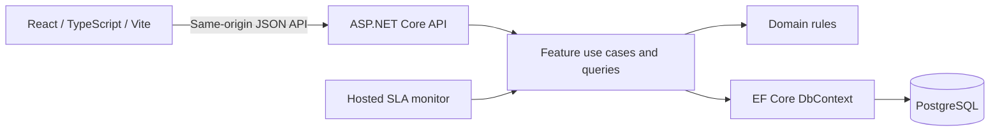

# ServiceOps — Initial Architecture Proposal

Status: Approved. Phase 1 implementation authorized September 29, 2026; later phases remain outside the current implementation scope.

Prepared: September 28, 2026. Organization: Atlas Facility Services.

Revised: September 29, 2026. The objective is a polished, credible portfolio application demonstrating senior engineering judgment, not a production replacement for a commercial field-service platform.

## 1. Purpose and scope

ServiceOps is an internal operations system for creating, assigning, tracking, and resolving facility-service work orders. Managers additionally receive operational and SLA reporting. The central engineering challenge is keeping workflow, deadlines, audit history, and dashboard drill-throughs consistent while presenting a dense but usable interface.

Build one React application, one ASP.NET Core API, and one PostgreSQL database. Use a modular monolith with feature-oriented application code, an explicit domain boundary, and direct EF Core persistence. The expected 150 locations and initial 750 work orders do not warrant distributed services, a warehouse, a message broker, or a separate read database.

Billing, payments, customer portals, technician mobile applications, SMS, mapping, inventory, multi-tenancy, complex permissions, and dispatch optimization remain outside scope. AWS topology and provisioning are deferred.

## 2. Decisions and working assumptions

The review decisions are incorporated below. Unchanged business defaults remain documented assumptions. Only Phase 1 is currently authorized for implementation.

| Topic | Proposed default and consequence |
| --- | --- |
| SLA meaning | Time to completed resolution, not acknowledgment or first response. Confirm that two hours to resolve a critical facility issue is intentional. |
| Calendar | Continuous elapsed time, 24/7, including holidays. No business-hours calendar or pause while waiting. |
| Workflow | New, Assigned, InProgress, OnHold, Completed, Cancelled. The first four are open. |
| Assignment | One optional technician per order. Technicians are workforce records, not necessarily login users. No availability or skill-matching engine. |
| Completion | Requires an assigned technician and a short resolution summary. Completed and Cancelled are terminal; follow-up work gets a new order. |
| Changes after creation | Title, description, and priority may change while open. Customer, location, and service type remain immutable. Priority changes recalculate SLA timestamps from the original creation time and record the previous/new priority and deadline. |
| Notes and history | Plain-text, append-only notes and activity. Corrections are new notes. No deletion, attachments, or rich text initially. |
| Identity | ASP.NET Core Identity and two server-enforced roles: Operations and Manager, with seeded demo users for each. Registration, account administration, password-reset UI, SSO, and complex authorization are outside scope. |
| Time zone | One configurable organization reporting zone, initially proposed as America/New_York; this is a business assumption to confirm. UTC storage throughout. |
| Scale | The fictional business has roughly 150 locations; the initial 50-location seed is a representative subset, not its complete estate. |
| Reference data | Customers, locations, and technicians are seeded/read-only initially; administration screens are outside the requested workflow. Inactive records remain available on historical orders. |

Retain 24/7 resolution-based SLAs and terminal Completed/Cancelled statuses. Reprioritization is explicitly supported for open orders as defined in section 8; reopening remains outside scope. Current Operations and Period Performance remain distinct dashboard concepts.

## 3. Application architecture and technology



Use .NET 10 LTS with ASP.NET Core 10 and EF Core 10, on supported patches. The official lifecycle lists .NET 10 support through November 14, 2028. Pin the SDK at implementation time and update patches routinely. Use the compatible Npgsql EF Core provider. Sources: [.NET support policy](https://dotnet.microsoft.com/en-us/platform/support/policy), [Npgsql provider](https://www.npgsql.org/efcore/).

Use PostgreSQL 18 on its latest supported minor release, subject to confirming provider compatibility in integration tests. Pin container versions; do not use floating `latest` tags. PostgreSQL maintains supported major releases through regular minor updates: [versioning policy](https://www.postgresql.org/support/versioning/).

HTTP endpoints validate transport input and invoke small, concrete use cases. Domain methods own status transitions and deadline rules. Query classes project directly to response DTOs with no tracking. EF Core handles persistence and transactions; do not wrap it in a generic repository. Avoid MediatR, a generic unit-of-work layer, event sourcing, and speculative service interfaces. Introduce an interface only at a real boundary, such as current-user access; use .NET TimeProvider for time.

Explicit exclusions: no microservices, generic repositories, MediatR, generic unit-of-work abstractions, Redis, message brokers, or event sourcing. Keep feature-oriented application code and explicit domain rules as the primary organizing mechanisms.

Work-order changes and their audit entries commit in one database transaction. Domain entities never become API response objects. OpenAPI defines the HTTP contract and generates frontend TypeScript types. CI checks for stale generated contracts.

## 4. Proposed backend structure

The tree below describes future files only.

```text
backend/
  ServiceOps.sln
  src/
    ServiceOps.Domain/
      WorkOrders/       # Aggregate, statuses, priorities, SLA rules
      Customers/        # Customer and location entities
      Technicians/
    ServiceOps.Api/
      Features/
        WorkOrders/    # Create, edit, assign, transition, list, detail
        Notes/
        Activity/
        Dashboard/     # Metric definitions and aggregate queries
        ReferenceData/
        Auth/          # Identity endpoints and role policies
      Persistence/
        ServiceOpsDbContext.cs
        Configurations/
        Migrations/
        Seeding/
      Identity/        # ApplicationUser and current-user adapter
      Background/      # Lightweight periodic SLA activity recording
      Common/          # Problem details, time/filter helpers
      Program.cs
  tests/
    ServiceOps.Domain.Tests/
    ServiceOps.Api.IntegrationTests/
```

Dependency direction: API references Domain; Domain references no ASP.NET Core or EF Core packages. Tests reference their subjects. Domain audit actor IDs are scalar identifiers; the Identity implementation stays in API. Features and persistence share one assembly intentionally. Extract a separate worker executable or infrastructure project only when deployment or integration requirements justify it.

## 5. Proposed frontend structure and UI stack

```text
frontend/
  src/
    app/                # Router, providers, layout, theme
    features/
      auth/
      dashboard/        # Filters, KPI cards, charts, attention table
      work-orders/      # List, create form, detail, workflow actions
      reference-data/   # Cached customer/location/technician lookups
    components/         # Shared status badges, page states, dialogs
    lib/
      api/              # Fetch client, generated contract, errors
      dates/
    test/
  e2e/
```

Recommend Material UI Core and MUI X Data Grid Community. Their visual consistency and table capabilities suit an internal operations platform. Community is MIT-licensed; advanced grid capabilities have commercial tiers. Use a dedicated business-filter toolbar and server-side filtering, single-column sorting, and page sizes of 25, 50, or 100. Do not depend on Pro multi-sort, grid multi-filter UI, or paid export features. Revisit licensing only if those become actual requirements. [MUI grid](https://mui.com/x/react-data-grid), [licensing](https://mui.com/x/introduction/licensing/).

Recommend Recharts for the trend and categorical charts: its composable React/SVG model fits the small chart set and it uses the MIT license. Supply tabular equivalents and keyboard-accessible drill-through links; a chart library alone does not ensure accessibility. [Recharts](https://github.com/recharts/recharts).

Use React Router for navigation, TanStack Query for server state, and React Hook Form with Zod for forms. Local React state handles dialogs and tabs; URL parameters own filters, sort, pagination, and detail tabs. No Redux initially. API validation remains authoritative. TanStack Query provides the server-state caching/invalidation model: [documentation](https://tanstack.com/query/latest/docs/framework/react/overview). Use stable, mutually compatible React/TypeScript/Vite versions and a supported Node LTS that satisfies Vite's engine requirements, pinned in lockfiles at implementation: [Vite guide](https://vite.dev/guide/).

UI direction: restrained Atlas branding, compact spacing, readable typography, persistent navigation, clear page titles, visible filter chips, and consistent status/priority/SLA badges. Dashboard shows summary cards, trend, categorical breakdowns, then actionable work. Detail is a full route with Overview, Activity, and Notes tabs. Creation can use a full-page form for tablet usability.

Customer changes clear the selected location. Disable location selection until a customer is chosen. Label every control, return focus after dialogs, expose errors inline, and announce save results. Use text/icons alongside color. Support keyboard navigation, reduced motion, sensible touch targets, and desktop/tablet layouts. Tables may scroll horizontally; important identity and action columns stay discoverable.

Provide skeletons for initial loading, preserved rows plus a refresh indicator for subsequent fetches, distinct empty-dataset and no-filter-results states, retryable error panels, and unauthorized/not-found routes. Invalidate detail, lists, activity, and dashboard after successful mutations. Refetch time-sensitive views every 60 seconds while visible and on focus; show the server's evaluation timestamp.

## 6. Domain model and relationships

Use UUID primary keys. Work orders also receive a database-sequence-backed human number, e.g. WO-10482, with a unique constraint; gaps are acceptable. Do not generate numbers with row counts.

| Entity | Main attributes and invariants |
| --- | --- |
| Customer | Id, Name, Code (unique), IsActive. Owns many locations. |
| Location | Id, CustomerId, Name, Code, address fields, IsActive. Code unique within customer; customer ownership cannot change after use. |
| Technician | Id, DisplayName, Email, IsActive. Can be assigned many orders; deactivation does not rewrite history. |
| ApplicationUser | ASP.NET Core Identity user with UUID ID, display name, active flag, and role membership. Owns authored notes and actions. |
| WorkOrder | Id, Number, LocationId, TechnicianId nullable, Title, Description, ServiceType, Priority, Status, CreatedAt, CreatedByUserId, UpdatedAt, SlaPolicyVersion, SlaDurationMinutes, SlaAtRiskAt, SlaDeadlineAt, SlaRevision, CompletedAt nullable, CancelledAt nullable, ResolutionSummary nullable, CancellationReason nullable, Revision. SlaRevision identifies a deadline calculation for deduplicating monitor events; Revision protects business mutations. |
| WorkOrderNote | Id, WorkOrderId, AuthorUserId, Body, CreatedAt. Append-only; paginated independently. |
| WorkOrderActivity | Id, WorkOrderId, ActorUserId nullable for system events, EventType, EffectiveAt, RecordedAt, SlaRevision nullable for threshold observations, structured before/after payload. Append-only. |

Customer has many Locations; Location has many WorkOrders; Technician optionally has many WorkOrders; WorkOrder has many Notes and Activities; User has many authored Notes and Activities. WorkOrder reaches Customer through Location, avoiding contradictory CustomerId/LocationId pairs. Creation still accepts both IDs and validates their relationship. Historical customer/location display uses current reference names; full historical name snapshots are not required initially.

ServiceType is a closed enum: HVAC, Electrical, Plumbing, Equipment, GeneralMaintenance. Priority and Status are closed enums as well. Persist readable values with database constraints and serialize stable string codes; UI labels are separate. WorkOrder is the write consistency boundary; do not eagerly load its entire notes/activity history.

Workflow rules:

- New -> Assigned when a technician is assigned; New -> Cancelled with a reason.
- Assigned -> New when unassigned; Assigned -> InProgress or Cancelled.
- InProgress -> OnHold, Completed, or Cancelled.
- OnHold -> InProgress, Completed, or Cancelled; entering OnHold requires a reason.
- Assigned, InProgress, and OnHold require an active technician on new assignments. Reassignment is allowed while open; unassignment after work starts is rejected.
- Completed and Cancelled have no outgoing transitions. Completion sets its timestamp once; cancellation records a reason and timestamp. Neither is counted as open.

Database constraints enforce required text, positive SLA duration, ordered SLA timestamps, valid terminal timestamps, unique numbers, and foreign keys. Use restrictive deletion; deactivate reference records instead. Apply explicit maximum lengths (title 200, description 10,000, note 5,000 characters) and normalize surrounding whitespace.

Use an application-managed numeric Revision as an EF concurrency token and return it in response bodies. Mutation bodies may include expectedRevision; the frontend supplies it for edits, assignment, priority changes, and status transitions. If it differs from the stored revision, return 409 Conflict with errorCode `stale_revision` and a clear reload-and-review message. Increment Revision on successful business changes and translate EF concurrency failures to the same response. Without expectedRevision, validate against the current loaded state; EF still detects changes between load and save, but cannot detect an earlier stale client view. Independent note appends need no revision check. Do not implement ETag/If-Match or 412/428 precondition handling. Audit JSON contains known event fields, not arbitrary entity dumps. NoteAdded events reference the note ID rather than duplicating its body.

Initial indexes: unique Number; (CreatedAt, Id); (Status, SlaDeadlineAt, Id) for open work; CompletedAt for reporting; (LocationId, CreatedAt); (TechnicianId, Status); and (WorkOrderId, EffectiveAt, Id) on activities. Validate plans before adding every possible filter combination. Parameterized case-insensitive title/number search is sufficient at this scale; consider PostgreSQL trigram indexes only after measurement.

## 7. API proposal

Use JSON under `/api/v1`, camelCase fields, ISO 8601 UTC timestamps, and explicit request/response DTOs. All endpoints require authentication except login and limited health checks. Manager policy protects dashboard endpoints; operations mutations permit both roles. The client never supplies an authoritative actor, creation timestamp, or SLA deadline.

| Method and route | Behavior |
| --- | --- |
| POST /auth/login; POST /auth/logout; GET /auth/me | Session lifecycle and current user/roles. |
| GET /auth/csrf | Obtain the antiforgery request token for cookie-authenticated mutations. |
| GET /customers | Active selection records; optional includeInactive for historical filtering. |
| GET /customers/{id}/locations | Dependent location lookup. |
| GET /technicians | Technician filter/assignment lookup. |
| GET /reference-data | Enum codes and display labels. |
| GET /work-orders | Filtered, sorted, paginated summaries. |
| POST /work-orders | Create; return 201, Location header, and detail including revision. |
| GET /work-orders/{id} | Detail plus computed SLA fields and revision. |
| PATCH /work-orders/{id} | Whitelisted title/description correction; optional expectedRevision. |
| PUT /work-orders/{id}/assignment | Set technicianId or null using workflow rules; optional expectedRevision. |
| PUT /work-orders/{id}/priority | New priority and optional expectedRevision; recalculate SLA and record priority/deadline changes atomically. |
| POST /work-orders/{id}/status-transitions | Target status and required reason/summary; optional expectedRevision. |
| GET, POST /work-orders/{id}/notes | Paginated notes; append a note. |
| GET /work-orders/{id}/activity | Cursor-paginated chronological activity. |
| GET /dashboard | KPIs, buckets, breakdowns, attention preview, and evaluatedAt. |

Example creation request:

```json
{
  "customerId": "<uuid>",
  "locationId": "<uuid>",
  "serviceType": "HVAC",
  "priority": "High",
  "title": "Rooftop unit not cooling the east wing",
  "description": "Staff report rising temperatures near the reception area."
}
```

List query parameters: `search`, `customerId`, `locationId`, `technicianId`, `unassigned`, `serviceType`, repeated `status`, `slaStatus`, `createdFrom`, `createdTo`, `completedFrom`, `completedTo`, `attentionOnly`, `sort`, `page`, `pageSize`. Dates are inclusive start/exclusive end instants. `openOnly=true` expands to the four open statuses. All filter families combine with AND; repeated statuses combine with OR. Reject contradictory assignment filters and invalid enum values.

Response envelope: `{ items, page, pageSize, totalCount, evaluatedAt }`. Default sorting is createdAt descending, with Id as a stable tie-breaker. Allowlist sortable fields such as number, createdAt, deadline, priority, status, and customerName. Use explicit priority ranks rather than alphabetical ordering. Search is bounded to 200 characters; page starts at 1 and pageSize is capped at 100. Offset pagination is appropriate initially; no claim of snapshot stability across concurrent inserts.

Return RFC Problem Details with safe message, stable errorCode, traceId, and field errors. Use 400 for invalid input, 401/403 for authentication/authorization, 404 for missing records, and 409 for stale revisions or invalid business transitions, distinguished by errorCode. Handle unexpected failures centrally and never expose stack traces. Requests accept cancellation and use bounded database timeouts.

Use database repeatable-read transactions for a dashboard response's multiple aggregate queries and a list's rows/count, evaluated against one captured server time. This prevents internally mismatched totals. A later click can reflect subsequent edits or elapsed time; do not imply historical snapshot navigation.

## 8. SLA calculation and monitoring

On creation, the backend captures one UTC instant from TimeProvider, looks up the priority policy, and persists its version, duration, risk timestamp, and deadline in the creation transaction.

| Priority | Duration | At risk after |
| --- | --- | --- |
| Critical | 2 hours | 90 minutes |
| High | 4 hours | 3 hours |
| Normal | 8 hours | 6 hours |
| Low | 24 hours | 18 hours |

`deadline = createdAt + duration`; `riskAt = createdAt + duration * 0.75`.

For open orders, Good means now < riskAt; AtRisk means riskAt <= now < deadline; Breached means now >= deadline. This proposes an explicit inclusive breach boundary. OnHold continues the clock. Terminal orders have no active SLA state; return null rather than misleadingly showing Good. Separately derive completion outcome as Met when completedAt <= deadline and Missed when completedAt > deadline. Cancellation has no completion outcome and is excluded from resolution averages. Completing exactly at the deadline is therefore on time, although an order still open at that instant is due/breached by the operational boundary convention.

Never use a worker-updated status column as the authoritative current SLA state. Lists, details, dashboard counts, and filters evaluate the same timestamp predicates in SQL using the captured server time; domain tests verify the equivalent pure rules. Persisted policy/duration values prevent configuration changes from silently rewriting deadlines.

### Priority changes

An open order can move to any priority. The domain operation validates that it is not Completed or Cancelled, obtains the new priority's duration, and recalculates riskAt and deadline from the ORIGINAL CreatedAt, never the change time. Update the persisted policy/duration/timestamps, increment SlaRevision and Revision, and append one PriorityChanged activity in the same transaction. Its payload records previousPriority, newPriority, previousDeadline, and newDeadline (plus previous/new riskAt for clarity). Return the newly derived SLA state immediately, without waiting for the monitor. Choosing the existing priority is a no-op, with no revision increment or duplicate activity.

For example, an order created at 08:00 with Normal priority has riskAt 14:00 and deadline 16:00. Changing it to High at 13:00 gives riskAt 11:00 and deadline 12:00: it is immediately Breached. Changing it to Low instead gives riskAt 02:00 the next day and deadline 08:00 the next day: it becomes Good. Keep earlier SLA activity as history associated with its prior SlaRevision; do not delete it or present it as the current state.

### Lightweight monitoring

Use a BackgroundService inside the single API process, with a non-overlapping PeriodicTimer every 60 seconds and a fresh DI scope per pass. Read currently open orders and append missing AtRisk and Breached observations for elapsed thresholds on their current SlaRevision. If both thresholds have elapsed, both events may be recorded. Use a unique filtered constraint on (WorkOrderId, SlaRevision, EventType) for these two activity types so normal repeated passes do not duplicate them. Other activity types are not subject to that constraint. Store the observed SLA revision and deadline in the event payload. ASP.NET Core supports this hosted-service/scoped-work pattern: [hosted services documentation](https://learn.microsoft.com/en-us/aspnet/core/fundamentals/host/hosted-services?view=aspnetcore-10.0).

These events describe a state observed during a pass, not guaranteed historical transition instants. Set EffectiveAt and RecordedAt to observation time; include the threshold timestamp in the payload. This avoids backdating a newly shortened SLA to before the priority change. Activity storage has an optional SlaRevision field for threshold-event deduplication. Monitoring does not increment the business Revision. A concurrent mutation may leave an observation associated with a just-superseded SLA revision; its payload makes that context visible. Business mutation activity remains transactional and authoritative.

Log pass failures and try again at the next normal interval; honor cancellation. Do not add distributed coordination, explicit row locks, sophisticated outage reconciliation, custom retry infrastructure, Hangfire, or Quartz. Missed observations for orders closed during downtime are not backfilled. This is an accepted portfolio limitation: activity monitoring is best-effort, while current SLA calculations and dashboard metrics remain correct even with the worker disabled. Reconsider infrastructure only if implementation demonstrates a concrete need.

## 9. Dashboard definitions and drill-throughs

Do not let a recent date range hide old breached backlog. Divide the dashboard into clearly labeled **Current operations** and **Period performance** sections. Customer and service filters apply everywhere. The selected date range applies only to period performance; show this explicitly beside the current section. Default to the last 30 calendar days in the organization time zone, ending at the next local midnight. Convert boundaries to UTC; calendar-day durations can vary across daylight-saving changes.

| Metric/chart | Definition and destination |
| --- | --- |
| Open Work Orders | All currently open matching orders, regardless of creation date. Click -> openOnly. |
| SLA At Risk | Open orders currently AtRisk. Click -> same SLA filter. |
| SLA Breached | Open orders currently Breached. Click -> same SLA filter. |
| Completed Work Orders | completedAt within the period. Click -> completedFrom/completedTo and Completed status. |
| Average Resolution Time | Mean completedAt minus createdAt for those completions; elapsed hours, cancellations excluded. No completions -> em dash, not zero. Click -> that completed cohort. |
| Created vs Completed | Two independent timestamp series within each period bucket. Complete zero-filled day buckets, or week buckets for wider ranges. Click -> corresponding created/completed bucket bounds. |
| Work Orders by Status | Current status of orders created within the selected period; label as a created cohort, not historical end-of-period status. Click -> created range plus selected status. |
| Work Orders by Service Type | Count created within the selected period by service type. Click -> created range plus selected service. |
| Requiring Attention | Open and (AtRisk or Breached or unassigned). Top 10, breached first, then at risk, then unassigned; deadline ascending within each group. Click -> attentionOnly or a detail route. |

The attention union counts an order once. No percentage compliance KPI is required initially; do not confuse current breached backlog with completed-order compliance. Include sample counts with resolution averages. API queries and list predicates share definitions; integration tests prove each drill-through matches its metric on a fixed dataset/time. Historical backlog snapshots are not promised by this design.

## 10. Identity, reliability, and operational quality

Use ASP.NET Core Identity with same-origin HttpOnly session cookies, Secure outside local development, an appropriate SameSite policy, and antiforgery protection for mutations. Use framework password hashing and lockout; rate-limit login attempts. Seed fictional development/demo users for both Operations and Manager using environment-provided passwords. No authentication bypass or frontend-only role enforcement. Registration, account administration, password-reset UI, SSO, and complex authorization remain outside scope; do not build extension infrastructure for them.

Log structured request completion, trace IDs, safe work-order identifiers, concurrency conflicts, and monitor results. Do not log passwords, cookies, free-text notes, or request bodies. Expose liveness separately from readiness/database connectivity; limit sensitive diagnostics to development. Audit history is business evidence, not a substitute for operational logs or a legally tamper-proof ledger.

Keep parameterized queries, strict input validation, plain-text rendering, restrictive same-origin access, and secret-free source control. Use asynchronous DB calls and project only needed columns. No Redis/cache initially: the dataset is small, and stale SLA counts would be costly. Measure API latency on representative data before adding optimization layers.

## 11. Docker and local development

Propose a monorepo with `backend/`, `frontend/`, `docs/adr/`, `infra/`, and a root Compose definition and README. This proposal can move to the repository root after approval.

Compose services:

- **db:** PostgreSQL, named persistent volume, pg_isready health check; bind any host database port to loopback.
- **migrate:** one-shot command using the backend image, waits for database health, applies checked-in migrations, exits on failure.
- **seed:** explicit development-only profile/command, runs after migration, never automatically clears a database.
- **api:** waits for migration success, runs the API and hosted monitor, accepts configuration from environment; optional dotnet watch development override.
- **web:** Node/Vite development server with source bind mount and isolated node_modules volume, bound locally; proxies `/api` to the api service so the browser uses one origin. Proxy configuration must include login/session routes.

Offer two documented workflows: full Compose for reproducibility, and database in Compose with frontend/API running on the host for debugger convenience. Use the same schema and configuration names in both. A production-like local profile builds React assets and serves them from the API's static-file host, with API routing before the SPA fallback. Use multi-stage builds and a non-root runtime image. This does not choose AWS hosting.

Pin compatible SDK, Node, NuGet/npm dependencies, and image versions; commit dependency lockfiles. Provide `.env.example` with nonsecret placeholders and keep actual `.env` ignored. Persist development cookie-protection keys if login survival across container restarts is desired. Avoid automatic migration during every API startup. Document startup, migration, seed, tests, and an explicitly destructive reset command after implementation.

## 12. Seed data plan

Generate 20 fictional customers, 50 locations, 15 technicians, both user roles, and about 750 work orders spanning six months. Example naming style: Harborstone Logistics, Cedar Vale Offices, Westhaven Retail Group; locations such as North Distribution Center and Willow Park Campus; technician names such as Elena Brooks and Marcus Chen.

Use a deterministic random seed and one configurable reference instant. Weight scenarios by customer/site size and plausible service mix, with a majority of completed work, a smaller cancelled cohort, and a current open queue. Recent orders should intentionally include Good, AtRisk, and Breached examples across priorities. Historical open backlog can exist but should not overwhelm all KPIs.

Generate coherent status/assignment activity, representative priority changes with previous/new deadlines, authored notes, realistic issue descriptions, and varied resolution durations including late completions. All timestamps follow the same workflow/SLA rules as production. Apply a seed-version marker for idempotency; rerunning does not silently rebase existing deadlines. Refreshing the demonstration clock/data requires an explicit local reset or fresh database. Explain that SLA states naturally age while the environment runs.

## 13. Verification and acceptance strategy

Prioritize portfolio value over exhaustive enterprise coverage. Domain tests cover SLA calculations and exact boundaries, priority changes anchored to original creation, immediate SLA-state changes, rejection of terminal reprioritization, and legal/illegal workflow transitions. Use fake time, not real sleeps.

Use a small real-PostgreSQL integration suite for creation/location validation, combined filtering and pagination, role restrictions, a stale-revision conflict, atomic priority/activity persistence, and dashboard metric/list agreement. Add one focused monitor test for repeated-pass deduplication and a check that SLA reads remain correct without the worker. Avoid EF's in-memory provider for relational behavior. Do not build outage simulation, distributed-worker, or exhaustive concurrency suites.

Frontend tests target dependent customer/location selection, priority-change feedback, and URL filter behavior. Keep a small end-to-end suite: one operations lifecycle and one manager dashboard drill-through. Review loading, empty, failure, conflict, keyboard, and tablet behavior manually, supplemented by focused accessibility checks. Add regression tests for meaningful defects rather than chasing a coverage percentage.

CI will run format/lint, TypeScript checking, production frontend build, backend build, domain/integration tests, contract drift checks, and a small critical-path end-to-end suite. Document measured query latency, test scope, and known limitations rather than claiming production readiness from unit tests alone.

## 14. Proposed ADRs

Create these as Proposed records, then mark Accepted only after architecture approval. Each should record context, decision, alternatives, consequences, and reconsideration triggers.

| ADR | Decision |
| --- | --- |
| 001 | Modular monolith, two backend production projects, direct EF Core, one database. |
| 002 | Workflow, terminal statuses, immutable customer/location/service, editable open-order priority, and audit retention. |
| 003 | SLA resolution target, 24/7 calendar, original-createdAt recalculation, derived states, and lightweight monitoring limitations. |
| 004 | Dashboard cohort definitions, current backlog versus period filters, time zone and date boundaries. |
| 005 | Identity cookies, seeded users for two roles, CSRF protection, and excluded account features. |
| 006 | REST/OpenAPI contract, explicit mutations, pagination, and body-based expectedRevision/409 concurrency. |
| 007 | Material UI Community grid, Recharts, URL state, and dependency/licensing policy. |
| 008 | Compose topology, explicit migrations/seeding, deterministic fixtures, real-PostgreSQL tests. |

## 15. Review disposition and implementation gate

The September 29 review preserves the modular monolith, direct EF Core, explicit domain rules, Current Operations/Period Performance distinction, and deterministic approximately 750-order dataset. It replaces HTTP preconditions with simple revision conflicts, allows open-order priority changes, reduces monitoring to periodic observations, and narrows test scope to valuable business behavior and critical integrations.

Keep 24/7 resolution targets, the proposed reporting time zone, single-technician assignment, append-only notes, and no reopening as documented working defaults. No additional platform capabilities are implied. IMPLEMENTATION.md defines small vertical phases with review and commit boundaries. Following approval, Phase 1 alone is implemented; its review results and scope decisions are recorded in PHASE1_REVIEW.md. Stop for review before Phase 2.
