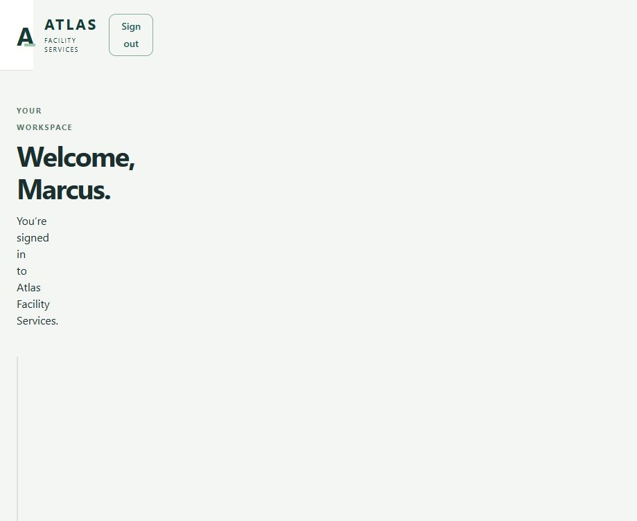
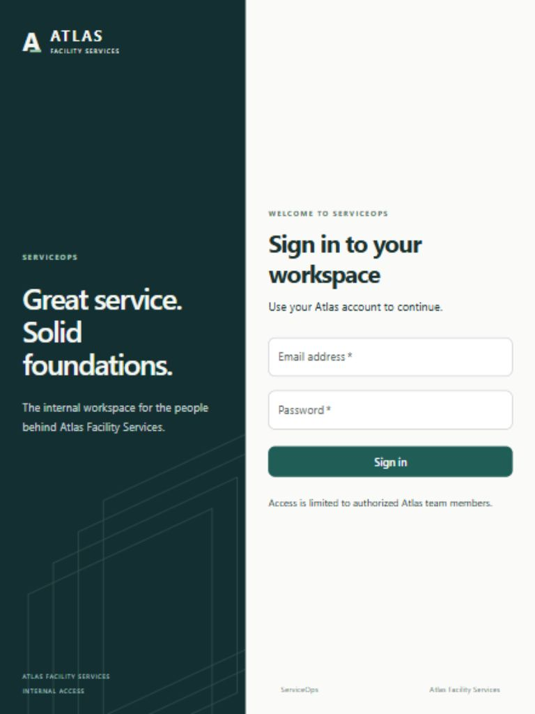

# Phase 1 review

Implemented September 29, 2026. Phase 2 has not started. No Git commit or remote publication has been made.

## Delivered

- ASP.NET Core API with Identity cookie sign-in/out, current-user and CSRF endpoints, Operations/Manager policies, input validation, Problem Details, JSON request logging, lockout/rate limiting, health endpoints, and development OpenAPI.
- Direct EF Core/Npgsql persistence, generated Identity migration, explicit migration command, and transactional/idempotent development user seeding.
- React/TypeScript/Vite frontend with Material UI login and account view, session loading/error states, role display, CSRF handling, and generated API types.
- API, empty Domain, and integration-test projects; Compose definition and Dockerfiles; pinned dependencies/lockfiles; minimal CI and startup documentation.

No business entities, work-order features, dashboard, future menu items, account administration, registration, password-reset UI, SSO, or AWS resources.

## Verification results

| Review requirement | Result |
| --- | --- |
| Backend build | PASS. Debug and Release solution builds; final Release build: zero warnings/errors. |
| Backend tests | PASS. Five PostgreSQL-backed checks (including two role theory cases), zero failed/skipped. |
| Frontend type check | PASS. `npm run typecheck`. |
| Frontend production build | PASS. `npm run build`; non-blocking bundle-size warning noted below. |
| Docker/local configuration | PARTIAL. Standalone Docker Compose validates default and tools-profile configuration. Registry manifests confirm all four pinned image tags exist. No Docker engine is installed here, so image builds and full Compose execution are unverified. |
| Local startup | PASS outside Docker. Real PostgreSQL 18.6 + .NET 10.0.12 + Vite started, migration command completed, seed command ran twice, frontend API proxy served browser authentication. |
| Both roles authenticate | PASS in integration tests and browser smoke checks; each account shows its correct role. |
| Anonymous protected requests | PASS. Current-user and test Manager-policy requests return 401 without redirecting. |
| Server-side roles | PASS. Operations is denied Manager access (403); Manager is allowed; both satisfy Operations policy. Probes are test-only controllers, not shipped features. |
| Seed reruns | PASS. Two users/two roles/two memberships remain, with unchanged IDs and password hashes. |
| Invalid login / CSRF / logout | PASS. Invalid credentials get clear failure text; missing CSRF is rejected; logout invalidates current-user access. |
| Browser review | PASS for keyboard-submitted sign-in/out, invalid-password feedback, Operations session refresh, both role displays, and 768×1024 login layout. In-app browser pointer automation did not reliably activate the button; pointer-only interaction was not confirmed. |
| Contract generation | PASS. Regenerating the OpenAPI TypeScript output produced identical contents. |
| Diff review | Reviewed auth, seed, frontend, configuration, dependencies, and generated files for scope and complexity. No premature business abstractions; whitespace check passes. |

Tests use isolated randomly named PostgreSQL databases, not an in-memory substitute. They use real Identity password checks/cookies. The workspace lacked .NET and Docker; .NET SDK and PostgreSQL test tools were downloaded under the surrounding `work/` folder. Windows shell TLS required a workspace-only transport workaround for NuGet using Node's HTTPS stack. None of those machine-specific tools/settings are included in the repository, Dockerfiles, or CI.

## Implementation decisions and deviations

1. **Empty Domain project:** the approved plan requests it, but Phase 1 has no domain behavior. It contains no invented entities/classes, and the API has no unnecessary reference to it.
2. **Same account page for both roles:** there is no legitimate manager-only product feature yet. Role badges reflect the signed-in identity; authorization is verified using controllers loaded only by the integration-test host. No artificial role-specific navigation was added.
3. **Simple forms:** React Hook Form and Zod are deferred. Native form constraints and backend DataAnnotations are sufficient for email/password. The two-field form uses ordinary React state.
4. **PostgreSQL test provisioning:** tests accept an environment connection and create/drop isolated databases. Locally this used a workspace PostgreSQL process; CI supplies a PostgreSQL service container. No Testcontainers dependency or custom test framework was needed.
5. **Framework CSRF service directly:** the two mutating auth actions call IAntiforgery directly. This avoids registering view-rendering services solely to use MVC's antiforgery attribute. No reusable filter framework was introduced.
6. **No durable development sessions:** container data-protection key persistence is optional in the architecture and deferred here. Signing in again after a restart is acceptable for this local demonstration.

These choices narrow Phase 1 to the user's implementation guidelines. The modular monolith, Identity roles, direct EF Core, and approved future domain design remain intact. Repository copies of the approved architecture/plan include updated approval metadata; the original review documents remain in the parent outputs directory.

## Remaining limitations / technical debt

- **Docker verification remains outstanding:** someone with Docker Desktop must run the README Compose startup before claiming full container verification. Configuration validation and registry checks are not substitutes for execution.
- **Vite bundle advisory:** the initial JS bundle is approximately 532 KB minified / 166 KB gzip. The build passes. No speculative chunking or dependency infrastructure was introduced to silence the warning.
- **Browser pointer verification:** keyboard activation and form submission work. The in-app browser's pointer automation did not confirm mouse activation; include a normal mouse click in the human review.
- Development container restarts may invalidate sessions. Persistent key storage and deployment hardening remain deferred.
- Login rate limits see the Vite proxy address in the local stack. Multi-user deployment/proxy configuration is not designed in Phase 1.
- CI is checked in but has not run on GitHub. No remote repository was created.

## Run and review

Use the exact Docker or host commands in [README.md](README.md). The Docker workflow starts with `.env.example`, three local passwords, `docker compose up --build -d`, and an explicit `docker compose --profile tools run --rm seed`.

Stop at Phase 1 review. No Phase 2 implementation is included or planned to run automatically.
