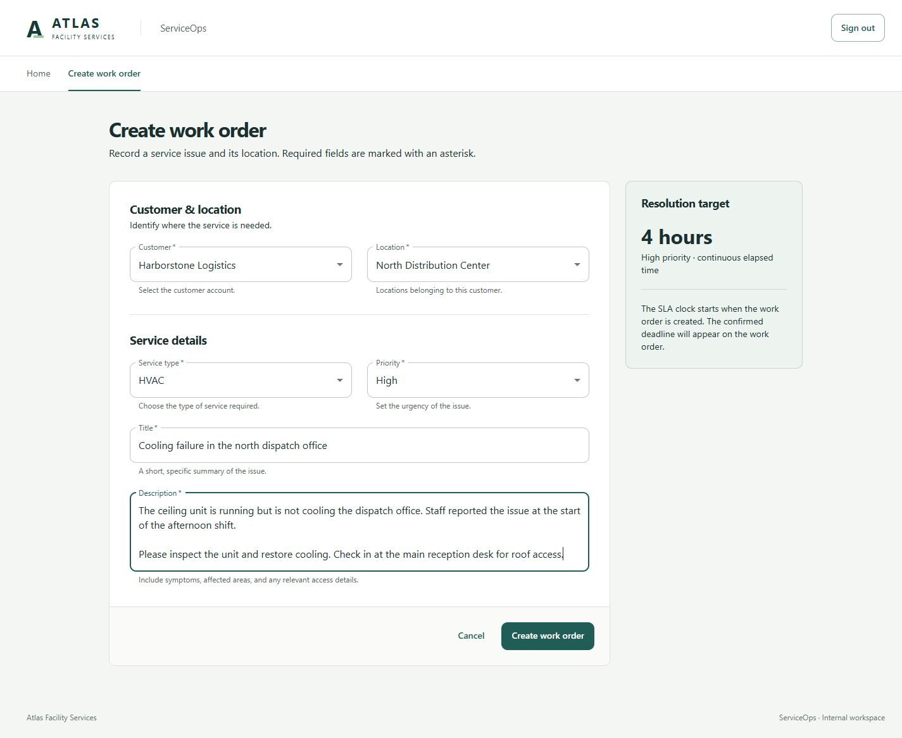
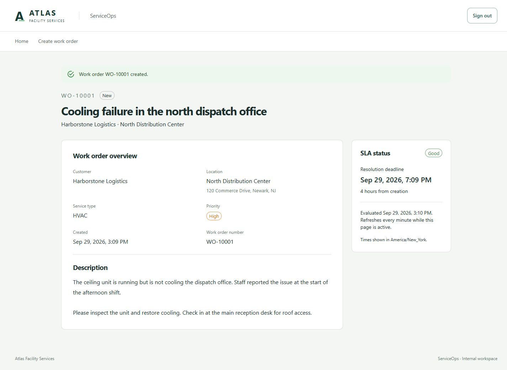
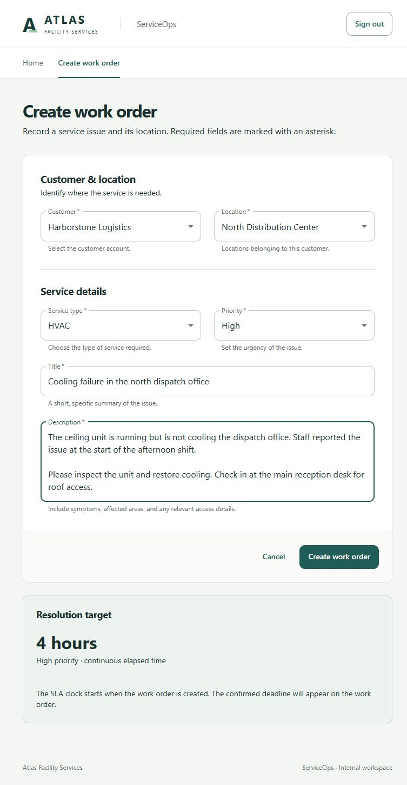
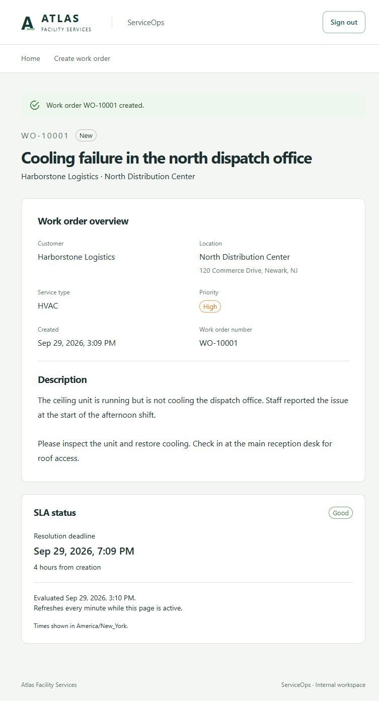

# Phase 2 review — Create and inspect a work order

September 29, 2026. Implemented in `C:\git\ServiceOps`, on top of the accepted Phase 1 commit `fbcdf59`. Changes are uncommitted and unstaged. Nothing was pushed. Phase 3 has not started.

## 1. Implemented behavior

Operations and Manager users can create a work order, receive its unique number and server-calculated SLA, and inspect it at a refreshable detail URL. Creation writes the order and initial Created activity atomically. Customer/location lookups and creation options support the form. Existing authentication remains intact.

## 2. Domain model actually created

- `Customer`: stable ID, code, name, active flag.
- `Location`: stable ID, customer ownership, code, name, display address, active flag.
- `Technician`: stable ID, display name, email, active flag. Seeded only; no assignment behavior or UI.
- `WorkOrder`: identity/number, location, title/description, service type, priority, New status, creator, immutable creation time, SLA policy version/duration/risk/deadline, Revision and SlaRevision, and read-only activities.
- `WorkOrderActivity`: identity, work-order ID, Created event type, actor, effective and recorded timestamps.

All entity setters are private. WorkOrder has a private constructor and is created through `WorkOrder.Create`. Its activity constructor is internal. The Domain project has no framework dependencies. Enums contain only the currently supported status/event behavior; future transitions are absent.

## 3. Business-rule ownership

| Rule | Location |
| --- | --- |
| Active customer and matching active location; valid classification; required trimmed title/description and length limits; valid actor | `WorkOrder.Create` |
| Critical 120, High 240, Normal 480, Low 1440 minutes | `WorkOrder.SlaDurationFor` |
| Capture original UTC creation time once; risk at 75%; deadline at full duration; initial New status and revisions 1 | `WorkOrder.Create`, using injected `TimeProvider` |
| Good before risk, AtRisk from risk inclusive, Breached from deadline inclusive | `WorkOrder.GetSlaState`, using the server instant captured for each response |
| Initial Created activity with actor and matching effective/recorded time | Domain factory and `WorkOrderActivity` constructor |
| Authentication, role policy, CSRF, resolving references, actor from authenticated claims | API controllers and existing authentication configuration |
| Unique human number and relational constraints | PostgreSQL sequence/default and EF mappings |
| Atomic order/activity persistence | One EF Core `SaveChangesAsync` transaction |

No authoritative SLA-state column exists. The UI obtains duration options and current SLA state from the backend; it does not calculate business deadlines.

## 4. API endpoints created

All require the Operations policy, which permits Operations and Manager.

| Method/path | Behavior |
| --- | --- |
| `GET /api/v1/customers` | Active customer options, sorted by name |
| `GET /api/v1/customers/{id}/locations` | Active locations belonging to that active customer |
| `GET /api/v1/reference-data` | Service types and priorities with domain-derived duration options |
| `POST /api/v1/work-orders` | Six-field request, CSRF required; 201 with detail body and Location header |
| `GET /api/v1/work-orders/{id}` | Persisted detail plus server-derived SLA state and evaluation time; 404 when missing |

The POST DTO accepts only customerId, locationId, serviceType, priority, title, and description. Unknown properties are rejected, including attempts to override timestamps, deadlines, actors, IDs or status. Invalid inputs return field-level validation errors. Enum values serialize as stable strings; controller and OpenAPI JSON settings are aligned. Generated frontend types are checked in.

## 5. Database changes

Migration `20260929185745_WorkOrderCreation` adds Customers, Locations, Technicians, WorkOrders and WorkOrderActivities, plus `WorkOrderNumbers` starting at 10001. The default generates `WO-10001`-style numbers; gaps are acceptable. EF's empty-string sentinel allows the database default to run.

Mappings define required fields, maximum lengths, restrictive foreign keys, unique work-order numbers/customer codes/customer-location codes, allowed classification/status/event values, positive revisions and policy, meaningful text, and ordered SLA timestamps. Revision is mapped as an EF concurrency token. No mutation-concurrency protocol is needed yet. Only current-use and foreign-key indexes are added.

The existing Identity migration remains unchanged. Docker's API build now includes the Domain project reference. `has-pending-model-changes` reports no differences.

## 6. Reference seed

The explicit Development-only `--seed` command now adds exactly 20 customers, 50 locations and 15 technicians after ensuring the two Identity users exist. Examples include Harborstone Logistics, Cedar Vale Offices and North Distribution Center. All are fictional. Stable UUIDs and codes make reruns idempotent; existing rows are preserved. Keep the seed array ordering stable because IDs are tied to those positions.

No historical work orders are seeded. The single browser-review order was created manually in a scratch database, not added to repository seed data.

## 7. Frontend

- Shared workspace layout with Home and Create work order navigation only.
- Full-page Create screen with grouped fields, customer-dependent locations, inline validation, loading/empty/retry states, pending-submit guard, disabled controls during save, and success navigation.
- Detail screen with number, status, title, customer/location/address, service type, priority, original creation time, description, resolution deadline and SLA badge.
- Loading skeleton, not-found view, error/retry view, and stale-data warning if a background detail refresh fails.
- Detail responses refresh every minute while the page is active; evaluation time and display time zone are visible.
- Responsive desktop/tablet layout, with the SLA panel stacked below the main content at tablet widths.

There are no Activity/Notes tabs or future controls. Local form state is sufficient; no form framework was added.

## 8. Verification results

| Check | Result |
| --- | --- |
| Backend build and Release publish | Passed, zero warnings/errors; locked NuGet restore also passed |
| Domain tests | 9 passed: all four durations, exact boundary instants, creation fields/activity, text, mismatch and invalid classification/actor |
| PostgreSQL API integration tests | 20 passed, including the 5 retained authentication tests |
| Critical new API coverage | Create/read; immutable timestamps and current-time SLA; reference mismatch; invalid required fields; rejection of authoritative properties; unique numbers; seed reruns; missing detail; anonymous access; missing CSRF |
| Transaction rollback | Passed: forced activity-table constraint failure returns 500 and leaves neither order nor activity |
| Frontend component test | 1 passed: disabled location before customer selection; customer change clears selection and replaces options |
| Frontend type check | Passed |
| Frontend production build | Passed; Vite reports the bundle-size advisory described below |
| OpenAPI generation/drift | Passed; regeneration produces an identical SHA-256 hash |
| EF migration/model | Applied to local PostgreSQL; no pending model changes |
| Compose configuration | Passed standalone Compose validation |
| Browser journey | Operations login → form → High-priority order → detail → browser refresh passed |
| Browser SLA check | WO-10001 created at 3:09 PM; deadline 7:09 PM; Good state; backend tests independently assert exact timestamps |
| Responsive visual review | Create and Detail inspected at 1440px and 768px; screenshots below |
| Browser errors | No console errors/warnings during successful creation/detail journey; missing-order view also verified |
| Scope/diff review | No premature features, generic services, public domain setters, duplicate SLA policy, client-owned authoritative fields, credentials, or scratch tooling added |

Verification used workspace-only .NET 10.0.401 tooling, Node 24 and PostgreSQL 18.6. Temporary databases were isolated from the user's application database. Docker image execution and the hosted GitHub Actions run were not available in this environment; they are not claimed as tested. CI now runs the frontend test as well as the existing build/contract checks.

## 9. Architectural decisions and dependencies

The modular monolith remains React/TypeScript, ASP.NET Core, direct EF Core and PostgreSQL. Controllers orchestrate existing authentication, reference queries and the domain factory. There is no repository, generic service layer, unit-of-work wrapper, MediatR, broker, Redis or worker.

No runtime dependencies were added. A Domain test project reuses the existing xUnit/test-SDK versions. Frontend development-only additions are Vitest 5.0.2 (runner), Testing Library React 16.3.3 and DOM 10.4.2 (component interaction), and jsdom 30.1.1 (DOM environment). Existing runtime package versions are unchanged; lockfiles include the new test dependencies.

## 10. Scoped differences from the full architecture

The Phase 2 acceptance criteria are satisfied. The full architecture intentionally describes later phases; their fields, indexes, transitions, worker and UI are deferred. In particular, only New/Created exist now; assignment, terminal timestamps and edit behavior will arrive with their approved phases. Queue/reporting/activity-history indexes are deferred until those queries exist, consistent with the plan's scope discipline.

Location uses one bounded display-address string instead of separate address components, since this phase neither edits nor searches addresses. Customer/location options use dedicated lookup endpoints rather than returning the whole reference catalog with service options. These are small implementation simplifications, not additional product scope. Timestamps display in the browser's explicitly named zone; organization reporting-zone handling remains deferred to reporting.

## 11. Limitations and technical debt

- Docker runtime startup remains to be verified on a machine with Docker Desktop running. Local startup, migration, seed, API and UI were exercised successfully.
- Vite reports a roughly 549 kB minified JavaScript chunk (171 kB gzip). No speculative splitting or new loading infrastructure was introduced for two screens; measure and address during the planned polish phase if warranted.
- There is no work-order queue yet. Keep the created detail URL to revisit an order.
- Duplicate clicks are blocked while saving and POSTs are never automatically retried. A lost network response can still leave an ambiguous creation outcome; the UI explains this. Server idempotency infrastructure is outside this phase.
- SLA display can lag until its next minute refresh; all API responses calculate it against current server time. Failed refreshes display a warning.
- Existing Phase 1 cookie-key persistence/container restart limitations remain as documented in README.

## 12. Screenshots

Captured from the running application after Operations sign-in, using realistic fictional data.

## Most important review files

Paths below are relative to `C:\git\ServiceOps`.

1. `backend/src/ServiceOps.Domain/WorkOrders/WorkOrder.cs` — creation invariants and SLA rules.
2. `backend/src/ServiceOps.Domain/WorkOrders/WorkOrderActivity.cs` — creation audit event.
3. `backend/src/ServiceOps.Api/Features/WorkOrders/WorkOrdersController.cs` — request trust boundary, atomic save and detail projection.
4. `backend/src/ServiceOps.Api/Persistence/Configurations/WorkOrderConfiguration.cs` and `Persistence/Migrations/20260929185745_WorkOrderCreation.cs` — database guarantees and number generation.
5. `backend/src/ServiceOps.Api/Persistence/Seeding/ReferenceDataSeed.cs` — deterministic seed.
6. `backend/tests/ServiceOps.Domain.Tests/WorkOrderTests.cs` and `backend/tests/ServiceOps.Api.IntegrationTests/WorkOrderApiTests.cs` — boundaries and real PostgreSQL behavior.
7. `frontend/src/features/work-orders/CreateWorkOrderPage.tsx`, `WorkOrderDetailPage.tsx`, `api.ts` and `CreateWorkOrderPage.test.tsx` — complete UI slice and dependent selection test.
8. `frontend/src/lib/api/schema.d.ts`, `backend/src/ServiceOps.Api/Program.cs`, `README.md` and `.github/workflows/ci.yml` — contract, startup and verification.

Run/upgrade commands are in README. Stop here for Phase 2 review; no commit or push has been created.
