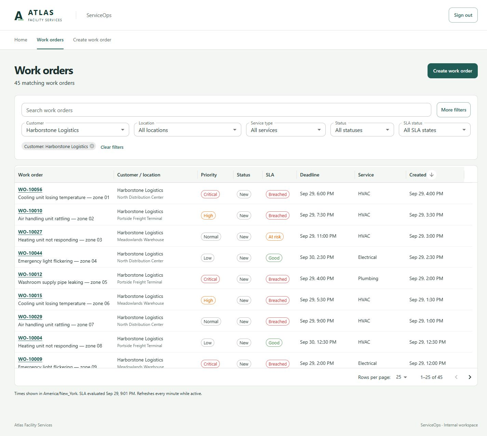
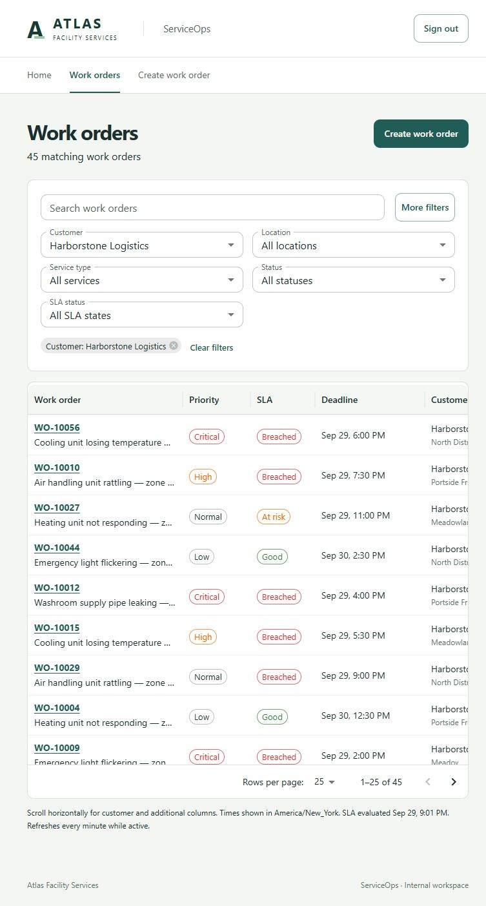

# Phase 3 review — Searchable operations queue

September 29, 2026. Implemented in `C:\git\ServiceOps`, based on accepted Phase 2 commit `690351f`. Changes are unstaged and uncommitted. Nothing was pushed. Phase 4 has not started.

## 1. Implemented

A Work orders page provides debounced search, business filters, active-filter chips, server sorting/pagination, a Create work order action, and explicit number links to the existing detail page. Its URL preserves queue context across refresh, browser history and detail navigation. Operations and Manager retain access through the existing Operations policy.

## 2. Supported request parameters

`GET /api/v1/work-orders` accepts the following. Different families combine with AND.

| Parameter | Semantics |
| --- | --- |
| `search` | Trimmed case-insensitive literal substring of number or title; maximum 200 characters. `%`, `_` and backslash are escaped rather than treated as pattern syntax. |
| `customerId` | UUID, through the order's location ownership. |
| `locationId` | UUID. Works independently; a conflicting customer/location combination naturally returns zero results. |
| `serviceType` | HVAC, Electrical, Plumbing, Equipment or GeneralMaintenance. |
| Repeated `status` | OR within the family; only New currently exists. Duplicate New values do not duplicate rows. Other workflow statuses are rejected until implemented. |
| `slaStatus` | Good, AtRisk or Breached, derived from timestamps and one request evaluation instant. |
| `createdFrom` | Inclusive timestamp; requires ISO time with Z or an explicit UTC offset. |
| `createdTo` | Exclusive timestamp; same format; must be later than the start when both are supplied. |
| `openOnly` | true restricts to the currently implemented open status, New. false adds no restriction. |
| `sort` | number, createdAt, deadline, priority, status or customerName. Prefix `-` for descending. Default `-createdAt`. Every ordering adds Id ascending as a tie-breaker. Priority ascending is Critical → High → Normal → Low. |
| `page` | 1-based positive integer; default 1. Offsets beyond the supported integer range are rejected. |
| `pageSize` | 25, 50 or 100; default 25. Other sizes are rejected. |

Invalid values return HTTP 400 validation Problem Details. Unknown parameters are rejected to avoid silently ignored filters. `technicianId`, `unassigned`, `completedFrom`, `completedTo` and `attentionOnly` are deliberately unsupported. WorkOrder has no assignment or completion fields yet, and the approved attention definition includes unassigned work. They are neither faked nor partially redefined. No corresponding UI controls or assignment values ship.

## 3. Summary response

```text
{
  items: [{
    id, number, title,
    customerId, customerName, locationId, locationName,
    serviceType, priority, status, slaState,
    deadline, createdAt
  }],
  page, pageSize, totalCount, evaluatedAt
}
```

Enums are stable string codes; timestamps are ISO UTC values. Descriptions, audit records, creator details and other detail-only fields are not loaded into list responses. `evaluatedAt` exposes the instant used by both SLA filtering and summary projection.

## 4. Query/filter/sort approach

`WorkOrderListController` owns one explicit feature query with direct EF Core. It validates inputs, captures `TimeProvider.GetUtcNow()` once, and projects only summary columns. There is no repository, generic query builder, entity Include, activity load, client-side row filtering or N+1 application query.

The projected SLA CASE expression mirrors `WorkOrder.GetSlaState`: deadline inclusive is Breached, risk inclusive is AtRisk, otherwise Good. Filtering reuses that projected expression instead of declaring separate SLA predicates. PostgreSQL integration tests compare it with the existing domain method at exact boundaries, including one microsecond before each threshold. No worker is running or required.

Count and page queries execute in one repeatable-read transaction, as required by the architecture. Offset pagination uses an explicit sort allowlist and Id tie-breaker. A later request can see new orders or advancing time; navigation does not promise a historical snapshot.

## 5. Database/index review

No schema changes or indexes were added. Generated EF SQL was inspected during a real queue request: one COUNT and one projected page query with parameterized LIMIT/OFFSET, joins to Locations/Customers, and a CASE expression using the captured evaluation parameter. The query excludes descriptions and activities.

Representative `EXPLAIN (ANALYZE, BUFFERS)` checks on the 60-order fixture showed small sequential scans/top-N sorting, with existing primary-key/reference indexes supporting joins. The combined customer/service/title query executed in approximately 0.18 ms in this local check. This is a small local measurement, not a production performance claim. It did not justify a new index. The architecture's broader queue/reporting index list remains a candidate for measurement against the later dataset; no speculative filter-combination indexes were created.

## 6. Frontend page/components

- `WorkOrdersPage.tsx`: complete queue, filter toolbar, secondary created-time/open controls, chips, grid, error and empty states.
- `queueState.ts`: small, queue-specific URL reader/update functions. No global state library or generic filtering framework.
- The only added runtime dependency is `@mui/x-data-grid` **9.14.0**, the MIT Community package. Existing MUI/React versions satisfy its published peers. It uses controlled server pagination/sorting/filtering, not a new data-source abstraction. No Pro features, exports, column customization or bulk controls are enabled. See [MUI server pagination](https://mui.com/x/react-data-grid/pagination/) for the supported controlled-grid approach.
- Desktop combines number/title and customer/location for scanning. Tablet prioritizes number/title, priority, SLA and deadline; other columns remain available by horizontal scrolling. Text accompanies badge colors, and full truncated titles are available via hover text/detail.

## 7. URL-state behavior

The browser URL owns search, filters, sort and pagination. Search commits after 350 ms, and search/filter/sort/page-size changes reset page to 1. Changing customer clears location. Active chips can remove a filter; Clear filters resets the queue.

Browser Back/Forward restores controls and rows. Direct navigation and refresh on a filtered page-two URL were verified. Detail links carry the originating queue URL in router history state; the small Back to work orders link restores it, including after detail refresh. A detail opened without that state falls back to the unfiltered queue. Browser Back also works normally.

Grid sort/pagination models have stable references. Grid reconciliation must not overwrite URL state; the grid is keyed to the request URL so returning from a smaller result set restores the correct controlled page. A real-grid frontend regression test covers this behavior. Invalid page sizes receive safe grid presentation values while the original URL is passed unchanged to the API for a clear validation response.

## 8. Loading, empty and error states

- Initial query: grid loading state and labeled progress indicator.
- Filter/sort/page refresh: prior rows remain visible with an explicit Updating results message and progress indicator.
- Empty database: No work orders yet and the existing Create action.
- No filter matches: No matching work orders and Clear filters. An unfiltered probe is made only after an empty filtered result to distinguish this from an empty database; the main API envelope stays unchanged.
- Empty out-of-range page: Go to first page.
- Query failure: error message and Retry; existing same-query data can remain with a stale-data warning, while a failed new query shows Queue unavailable.
- Expired session: clear message and Sign in again action.
- Reference lookup failure: separate retry for filter options.

The queue refreshes once per minute while active and on focus, showing the last server evaluation time. Created-time filter controls explicitly use UTC; row timestamps use the displayed browser time zone.

## 9. Verification

| Check | Result |
| --- | --- |
| Backend build | Passed; zero warnings/errors |
| Domain tests | 9 passed, retained Phase 2 suite |
| PostgreSQL API integration tests | 43 passed, including authentication/creation regression checks and 23 new list cases |
| List coverage | Default and explicit paging, disjoint stable pages/ties, all allowlisted sorts, business priority order, search/escaped wildcards, customer/location/service/status combinations, repeated-status OR, all SLA states and boundaries, inclusive/exclusive created instants, offsets, invalid/deferred parameters, anonymous rejection and empty result |
| Frontend tests | 7 passed, including retained creation test, URL parsing/updates, debouncing, customer/location/page reset, history restoration and real-grid page-two regression |
| Frontend type check/build | Passed |
| OpenAPI/generated contract | Regenerated; a second generation has identical SHA-256 content |
| Manual journey | Operations login → queue → title search → multiple filters → priority sort → page 2 → detail → return; exact queue URL and page preserved |
| Direct URL/refresh/history | Passed, including Back/Forward from a smaller result set |
| Clear/no-results | Passed; clear restores all 60 review rows |
| API failure/retry | Verified by stopping the scratch PostgreSQL process, showing a useful failure, restarting it, and retrying successfully |
| Visual review | Desktop 1440px and tablet 768px reviewed; screenshots included below |
| Final scope review | No N+1 entity loads, arbitrary property sorting, client-side filtering, generic query framework, new domain setters, later-phase mutations or local credentials/tooling added |

Initial test connection and grid-state failures were corrected before these final results. Verification used local .NET 10.0.401, Node 24 and PostgreSQL 18.6. Hosted GitHub Actions and Docker image execution were not run here. Existing CI runs the expanded suites automatically.

## 10. Architectural decisions

Preserved the modular monolith, Domain model, direct EF Core and generated OpenAPI types. Query validation, projection, filter logic and sorting stay together in this one feature controller. SQL needs an equivalent SLA expression to filter before paging; exact-boundary tests keep it aligned with the pure domain rule.

The optional `QueueReviewFixture` creates 60 New orders through `WorkOrder.Create`, including creation activity, with varied priorities/services and fixed 30-minute creation spacing. A required `QueueFixture__AnchorUtc` fixes the content/timestamps. UUIDs and numbers are generated normally. It is a separate Development-only `--seed-queue` command, refuses a nonempty order database, and is not included in normal seeding. Reruns cannot duplicate or rebase orders. The 750-order historical dataset remains deferred.

No test framework or backend dependency was added. The new integration-test file shares the existing setup using a partial test class, avoiding a second database/auth fixture or a generic testing framework.

## 11. Differences from the full architecture/plan

The user explicitly limited filters to fields correctly supported today. Assignment, unassigned, completion and attention filtering are therefore deferred and rejected, not simulated. New remains the only valid status; repeated-status OR is exercised with New repeated, and meaningful multi-status combinations await workflow implementation.

No new indexes/migration were justified by the measured queries. This narrows the full architecture's prospective index list while following the phase's requirement to add only justified indexes. All other current queue behavior follows the approved phase scope.

## 12. Limitations

- The 60-row fixture is for review, not the eventual historical dataset or a scale benchmark. SLA states age with real server time.
- Offset pages are stable for tied sort values but are not frozen across separate requests when data changes.
- MUI Data Grid increases the current JavaScript bundle to roughly 1.09 MB minified / 330 kB gzip. Vite emits its size advisory. Route splitting remains a measured polish opportunity; no new bundling framework was introduced.
- Single-column sorting and horizontal scrolling use Community capabilities. No user-controlled column customization is included.
- Existing Phase 1 session-key persistence limitations remain: a local API restart during verification required sign-in again. Queue errors now offer that action for HTTP 401.
- Docker runtime and hosted CI remain externally unverified in this environment.

## 13. Screenshots





## 14. Most important review files

Paths are relative to `C:\git\ServiceOps`.

1. `backend/src/ServiceOps.Api/Features/WorkOrders/WorkOrderListController.cs` — validation, projected query, snapshot, SLA, allowlisted sort, pagination and DTOs.
2. `backend/tests/ServiceOps.Api.IntegrationTests/WorkOrderListTests.cs` — representative database/API behavior and exact SLA boundary equivalence.
3. `frontend/src/features/work-orders/WorkOrdersPage.tsx` — full operations queue and controlled grid.
4. `frontend/src/features/work-orders/queueState.ts`, `queueState.test.ts`, `WorkOrdersPage.test.tsx` — URL changes, debouncing and history/grid regressions.
5. `backend/src/ServiceOps.Api/Persistence/Seeding/QueueReviewFixture.cs` — optional bounded review data, separate from normal seeding.
6. `frontend/src/lib/api/schema.d.ts` and `frontend/package.json` / lockfile — generated contract and the one Community grid dependency.
7. `README.md` — running the queue and optional fixture; `ARCHITECTURE.md` / `IMPLEMENTATION.md` — phase-status updates only.

### Phase 2 code modified

| Existing file | Reason |
| --- | --- |
| `Program.cs` | Recognize the optional Development-only `--seed-queue` command. Normal seeding is unchanged. |
| `WorkOrderApiTests.cs` | Mark the test class partial so list tests reuse its existing isolated database/auth setup. |
| `App.tsx` | Register the queue route and working navigation item. |
| `CreateWorkOrderPage.tsx` | Invalidate queue queries after successful creation, so the new order is discoverable immediately. |
| `WorkOrderDetailPage.tsx` | Add only the Back to work orders navigation link with safe queue-context fallback. |
| Work-order `api.ts` | Add typed list fetch and summary/page types. |
| `styles.css` | Add queue-specific responsive layout/table styling. |
| Generated API types and npm manifests | Reflect the endpoint and required grid dependency. |

No Phase 2 domain entities, creation rules, persistence mappings, migrations or existing controller behavior were changed. Stop here for review; do not begin Phase 4.
