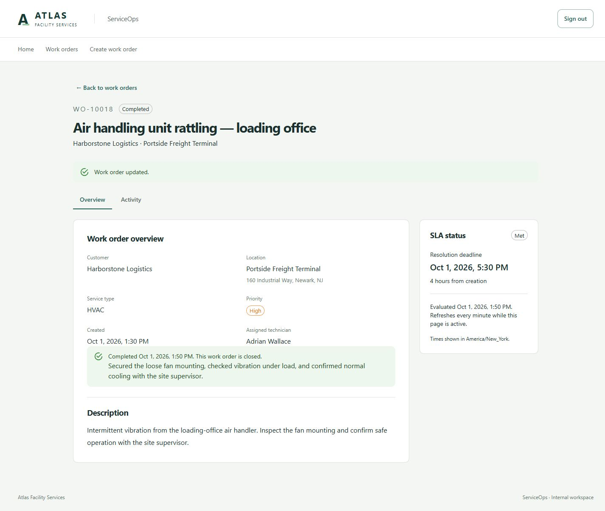
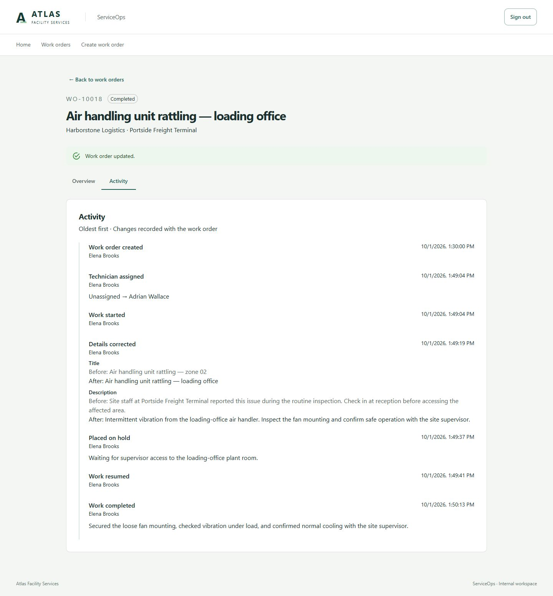
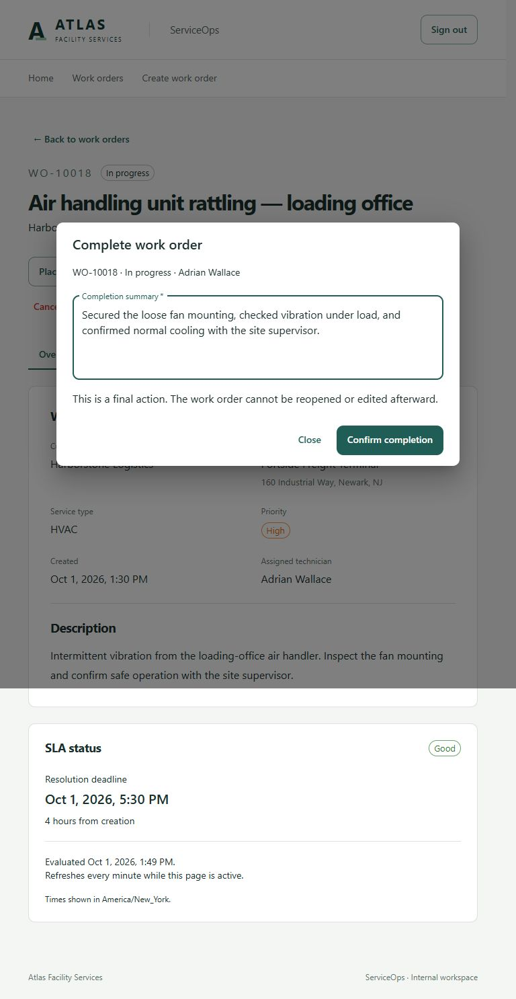
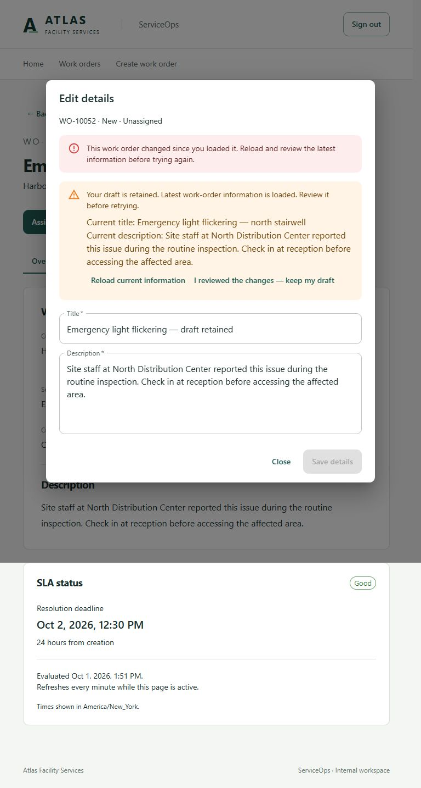
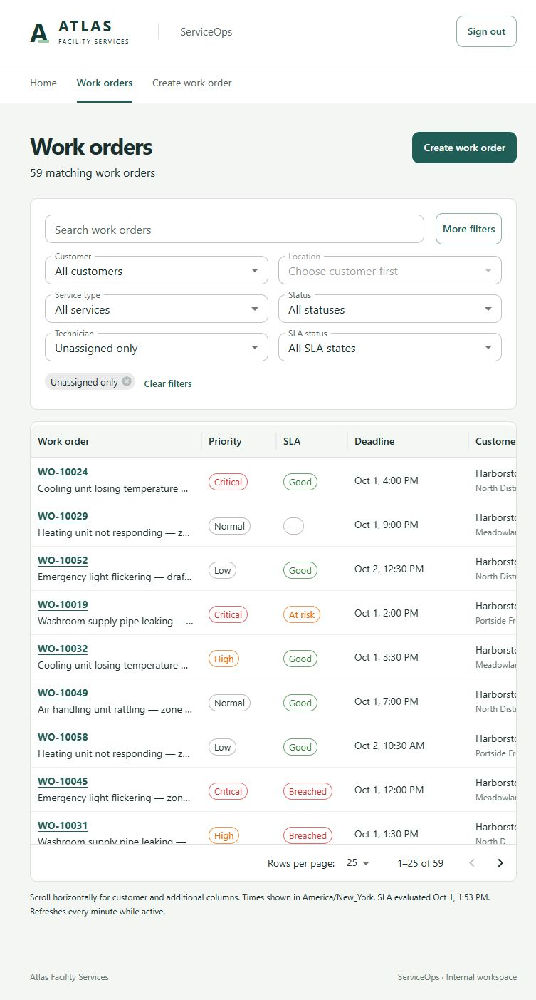

# Phase 4 review — Assignment, workflow, and editable details

October 1, 2026. Implemented on top of accepted Phase 3 (`0da5afc`) in `main`. Changes are intentionally uncommitted and unpushed. Phase 5 has not started.

## 1. What was implemented

Work Order Detail now supports assigning, reassigning and unassigning technicians, correcting title/description, and progressing through the approved lifecycle. Each real mutation records activity atomically, increments the business revision and refreshes affected detail/queue/history queries. The queue supports technician assignment and all six statuses. No dependency or project was added.

## 2. Domain behaviors

`WorkOrder` owns explicit `Assign`, `Unassign`, `UpdateDetails`, `StartWork`, `PlaceOnHold`, `Resume`, `Complete` and `Cancel` methods. Properties retain private setters. The domain validates state, active assignment and required text, updates timestamps/revision, and creates the appropriate activity. There is no general-purpose status setter or workflow engine.

Identical details, assignment to the same active technician, and unassignment of an already-New order are no-ops: no revision increment or duplicate activity. Terminal checks run before no-op checks. UpdatedAt and activity timestamps come from TimeProvider. Current SLA state remains timestamp-derived; it is null on terminal orders. Holding never pauses or recalculates SLA time.

## 3. Exact transition matrix

| Current state | Operation | Result | Required information |
| --- | --- | --- | --- |
| New | Assign | Assigned | Existing active technician |
| New | Cancel | Cancelled | Cancellation reason |
| Assigned | Unassign | New | None |
| Assigned | StartWork | InProgress | Existing assignment |
| Assigned | Cancel | Cancelled | Cancellation reason |
| InProgress | PlaceOnHold | OnHold | Hold reason |
| InProgress | Complete | Completed | Assigned technician and resolution summary |
| InProgress | Cancel | Cancelled | Cancellation reason |
| OnHold | Resume | InProgress | Existing assignment |
| OnHold | Complete | Completed | Assigned technician and resolution summary |
| OnHold | Cancel | Cancelled | Cancellation reason |
| Completed / Cancelled | Any mutation | Rejected | Terminal |

Reassignment and detail corrections preserve the current open status. All other transitions are rejected. Assigned/New are entered through assignment/unassignment, not through the status-transition endpoint.

## 4. Assignment rules

New orders have no technician. Assignment changes New to Assigned. Reassignment is allowed in Assigned, InProgress and OnHold without restarting work or clearing a hold. Unassignment is allowed only before work starts (Assigned to New); New-to-unassigned is a no-op. Unknown/inactive technicians are rejected server-side. Technician lookup includes active flags so inactive historical assignments remain filterable; selection offers active technicians only. No technician administration was added.

## 5. Editable and immutable fields

Title (1–200 trimmed characters) and description (1–10,000) can be corrected while open. Hold/cancellation reasons and completion summaries require 1–5,000 trimmed characters. Resume, completion and cancellation clear the current hold reason; the original reason remains in activity.

Customer, location, service type and **priority remain immutable**. Original creation/creator, number, SLA timestamps, duration/policy/SLA revision and activity actor/time cannot be supplied or rewritten by mutation callers. Completed/Cancelled orders reject all business mutations. Completion and cancellation timestamps are set once.

## 6. API endpoints

| Method / route | Request / response |
| --- | --- |
| PATCH `/api/v1/work-orders/{id}` | Title, description, optional expectedRevision; returns updated detail |
| PUT `/api/v1/work-orders/{id}/assignment` | Required technicianId (UUID or explicit null), optional expectedRevision; returns detail |
| POST `/api/v1/work-orders/{id}/status-transitions` | targetStatus, applicable reason/summary, optional expectedRevision; returns detail |
| GET `/api/v1/work-orders/{id}/activity` | Optional cursor and pageSize; returns items and nextCursor |
| GET `/api/v1/technicians` | Seeded technician IDs, display names and active flags |

All use the existing Operations policy (Operations and Manager). Cookie-authenticated mutations validate CSRF. Request DTOs disallow unknown properties. Validation returns 400, missing orders 404, stale revisions 409 `stale_revision`, and invalid business transitions 409 `invalid_transition`, using Problem Details and trace IDs. Actor IDs always come from the authenticated identity.

## 7. Optimistic concurrency and atomic persistence

The UI captures the displayed Revision when opening a dialog and sends it as expectedRevision. API callers may omit it, as the approved plan requires; omission applies domain rules to the currently loaded state and still protects the subsequent database write.

EF already maps Revision as a concurrency token. A tracked order retains its original revision; a real domain mutation increments the new value. EF includes the original value in the UPDATE predicate (`WHERE Id = ... AND Revision = original`). A competing commit therefore causes a zero-row update and DbUpdateConcurrencyException, translated into the same 409 stale_revision response as an already-stale request.

One SaveChanges transaction persists the order update and its new activity. Existing history is not loaded; newly constructed activity UUIDs are explicitly marked as inserts. An activity failure or a lost concurrency race rolls back both the mutation and its activity. No automatic mutation retry, distributed lock, ETag, If-Match, 412 or 428 protocol exists.

The integration race test uses a test-only SaveChanges interceptor barrier to make two real HTTP requests load the same revision before either saves. Exactly one succeeds, the other returns stale_revision, and only the winner's title/activity remains. The interceptor is confined to tests.

## 8. Activity types and data

| Event | Additional data |
| --- | --- |
| Created | Existing creation actor and timestamps |
| Assigned / Reassigned / Unassigned | Relevant technician IDs/names and previous/resulting status |
| DetailsCorrected | Before/after values for changed title and/or description only |
| Started / Resumed | Previous/resulting status |
| PlacedOnHold / Cancelled | Previous/resulting status and reason |
| Completed | Previous/resulting status and resolution summary |

Each row has its own ID, work-order ID, actor ID, effective and recorded timestamps. Known change fields are stored in nullable JSONB; no aggregate snapshots or event sourcing. The API joins the actor's display name. Retrieval is oldest-first by `(EffectiveAt, Id)`, with an opaque Base64 cursor, default page size 25 and maximum 100. The timeline renders only known human-readable fields; it does not show raw JSON. Timestamp ties use stable ID order rather than promising a separate sequence number.

## 9. Database migration

`20261001173449_WorkOrderWorkflow` adds TechnicianId/FK, UpdatedAt, HoldReason, CompletedAt, CancelledAt, ResolutionSummary, CancellationReason, and activity Changes JSONB. Existing orders receive UpdatedAt = CreatedAt; existing creation history is retained.

Constraints now allow the six statuses and ten activity types, require assignment in Assigned/InProgress/OnHold/Completed, prohibit assignment in New, require hold text only while OnHold, and enforce terminal timestamp/reason/summary consistency. Terminal times cannot precede creation. The migration adds the technician FK index and `(WorkOrderId, EffectiveAt, Id)` activity index. No reporting indexes or infrastructure were introduced.

Fresh migrations and upgrading existing New/Created data both passed integration checks. Normal forward migration is the supported upgrade. Downgrading after recording Phase 4 workflow data is not a supported data-preserving operation because the earlier schema permits only New/Created.

## 10. Queue changes

Added technicianId and unassigned filters, technician display, all six status values, and multi-select status URL parameters with OR semantics. Other filter families retain AND semantics. Contradictory technicianId plus unassigned=true is rejected. unassigned=false selects assigned records. Open only includes New, Assigned, InProgress and OnHold. Terminal rows have null active SLA state and display an em dash.

Existing search, stable sort/pagination, URL/history, dependent locations and loading/error behavior remain. Status chips remove only their corresponding status value. Successful mutations invalidate every work-order list query.

completedFrom/completedTo and attentionOnly remain deferred: their predicates are now technically possible, but Phase 4 does not assign them. The API continues rejecting them rather than silently ignoring them.

## 11. Detail UI

Overview shows technician, current status, immutable classification, description, SLA information and relevant hold/completion/cancellation text. Applicable actions are visible in a wrapping action row; impossible actions are absent. Material UI dialogs collect technician, correction text or required reason/summary. Completion and cancellation explicitly warn that the order cannot be reopened. There is no Notes placeholder.

The Activity tab has an independently paginated timeline with actor, timestamp, action and useful changes. The tab is URL-backed; the return-to-queue URL survives tab changes. On terminal records, detail shows completion outcome (Met at/before deadline, otherwise Missed) or cancellation as not applicable.

On stale revision, the current detail reloads while the draft remains intact. The dialog shows current title/description for comparison and disables saving until the user explicitly acknowledges review. Failed reloads can be retried; no mutation resubmits automatically. A newly terminal order blocks retry while preserving the draft for reference.

## 12. Tests and checks

| Check | Result |
| --- | --- |
| Backend build | Passed; zero errors; NU1900 environment warning described below |
| Domain tests | 17 passed (9 existing, 8 added) |
| PostgreSQL API integration tests | 51 passed (43 existing, 8 added) |
| Frontend type check | Passed |
| Frontend tests | 16 passed (7 existing, 9 added) |
| Frontend production build | Passed; existing bundle-size advisory remains |
| OpenAPI TypeScript generation | Passed against the running API |
| Contract drift | Regeneration produced the identical file hash |
| Migration | Fresh database plus existing New/Created upgrade/backfill passed |
| Compose configuration | `config --quiet` passed; container runtime unavailable |
| Local startup | PostgreSQL 18.6, API on 5080 and Vite on 5173 worked |
| Browser | Operations login, full lifecycle, activity, queue updates/filters, cancellation and two-tab conflict passed |
| Responsive review | Desktop 1440px and tablet 768px inspected; browser warning/error log empty |
| Diff/scope review | No public mutation setters, transaction gap, new dependency, secrets or later-phase implementation found |

Domain coverage includes valid/invalid paths, completion from hold, cancellation from each open state, assignment/reassignment/unassignment, no-ops, required text, all terminal mutation rejection and unchanged classification/SLA values. API coverage includes optional revision, real competing HTTP saves, activity rollback, active technician validation, server actor, prohibited fields, cursor pagination with timestamp ties, queue updates and migration preservation. Frontend coverage includes state-specific actions, cache refresh/invalidation, retained conflict drafts and explicit retry, plus existing queue history tests and multi-status/assignment URL restoration.

Manual completion used WO-10018; cancellation used WO-10029; two-tab conflicting corrections used WO-10052 in the separate local review database. No user database was reset. Review processes were stopped after verification.

## 13. Architectural decisions

Kept the modular monolith, dependency-free domain project, direct EF Core, Identity policies and existing frontend stack. Three narrow mutation endpoints share only a private controller helper for loading, error translation and saving. The controller dispatches target InProgress to StartWork or Resume; both domain methods enforce their own preconditions.

Used existing React local form state and TanStack Query rather than introducing a form library. Kept one concrete dialog component for current actions and one timeline component, with no reusable workflow/audit framework. No NuGet/npm dependencies, services, background processes or production projects were added. Seed behavior remains unchanged.

## 14. Deviations and scope decisions

No Phase 4 behavior was dropped. Optional expectedRevision follows the approved architecture/plan; the UI always supplies it. Local React form state continues the accepted earlier-phase approach rather than introducing the architecture's initially proposed React Hook Form/Zod packages. Added a persisted current HoldReason to support the required operations workspace; the architecture already requires hold reasons but its model table was illustrative.

Priority changes, notes, SLA observations/worker, dashboard/reporting, exports, technician administration, AWS and the full historical seed remain absent. The plan's later phases and Current Operations/Period Performance distinction are unchanged. Architecture/plan edits only update the review status and stopping boundary.

## 15. Limitations and technical debt

NuGet vulnerability metadata could not be fetched from api.nuget.org in this environment (NU1900); compilation and all tests succeeded with the existing locked packages. This is not a completed vulnerability audit. Docker Engine/Desktop is unavailable here, so Compose configuration was validated but containers were not built or run; host startup was exercised instead.

Vite reports the existing large-chunk advisory: approximately 1,110 kB minified / 336 kB gzip. No speculative bundle optimization was added. Existing ephemeral development cookie-key behavior remains unchanged. Activity is an application-managed append-only history, not a tamper-proof ledger; no activity editing endpoint exists. No reopening or priority editing is available in this phase.

## 16. Screenshots

Screenshots contain only fictional local demo data.

## 17. Important review files and earlier-phase changes

Review domain rules first, then mutation persistence/concurrency, migration, and UI conflict handling:

| File (repository-relative) | Purpose / earlier-phase impact |
| --- | --- |
| backend/src/ServiceOps.Domain/WorkOrders/WorkOrder.cs | Phase 2 aggregate extended with explicit lifecycle, current workflow fields, revision increments and terminal SLA null |
| backend/src/ServiceOps.Domain/WorkOrders/WorkOrderActivity.cs | Phase 2 activity extended with event type and known change payload |
| backend/src/ServiceOps.Domain/WorkOrders/WorkOrderTypes.cs | Phase 2 enums expanded only for Phase 4 |
| backend/src/ServiceOps.Api/Features/WorkOrders/WorkOrderMutationsController.cs | New narrow mutation DTOs, domain dispatch, CSRF and database concurrency handling |
| backend/src/ServiceOps.Api/Features/WorkOrders/WorkOrderActivityController.cs | New actor projection and chronological cursor retrieval |
| backend/src/ServiceOps.Api/Features/WorkOrders/WorkOrdersController.cs | Phase 2 detail extended with technician/workflow fields and nullable active SLA |
| backend/src/ServiceOps.Api/Features/WorkOrders/WorkOrderListController.cs | Phase 3 assignment/status filtering and terminal SLA handling |
| backend/src/ServiceOps.Api/Features/ReferenceData/ReferenceDataController.cs | Phase 2 lookups extended with technicians |
| backend/src/ServiceOps.Api/Persistence/Configurations/WorkOrderConfiguration.cs | Phase 2 mappings extended for workflow/audit fields and invariants |
| backend/src/ServiceOps.Api/Persistence/Migrations/20261001173449_WorkOrderWorkflow.cs | New schema migration/backfill; accompanying Designer and existing ModelSnapshot updated |
| backend/tests/ServiceOps.Domain.Tests/WorkOrderWorkflowTests.cs | New focused domain tests |
| backend/tests/ServiceOps.Api.IntegrationTests/WorkOrderWorkflowTests.cs | New lifecycle, atomicity, competing-write and migration tests |
| backend/tests/ServiceOps.Api.IntegrationTests/WorkOrderApiTests.cs | Existing fixture registers test-only race interceptor; original regression tests retained |
| backend/tests/ServiceOps.Api.IntegrationTests/WorkOrderListTests.cs | Earlier invalid-status/unassigned cases updated now those values are supported |
| frontend/src/features/work-orders/WorkOrderActions.tsx | New state-specific controls, dialogs, invalidation and conflict-draft behavior |
| frontend/src/features/work-orders/WorkOrderActivity.tsx | New chronological human-readable timeline |
| frontend/src/features/work-orders/statusLabels.ts | Labels shared by current detail/actions/queue |
| frontend/src/features/work-orders/WorkOrderDetailPage.tsx | Phase 2 detail integrates workflow, terminal presentation and URL-backed Activity |
| frontend/src/features/work-orders/WorkOrdersPage.tsx and queueState.ts | Phase 3 filters/display extended while retaining URL ownership |
| frontend/src/features/work-orders/api.ts | Existing client extended with error codes and current mutation/history/technician calls |
| frontend/src/features/work-orders/WorkOrderDetailPage.test.tsx | New action, refresh and retained-conflict tests |
| frontend/src/features/work-orders/WorkOrdersPage.test.tsx | Existing tests gain technician fixture and multi-status/assignment history regression |
| frontend/src/lib/api/schema.d.ts | Regenerated existing contract for the implemented API |
| README.md, ARCHITECTURE.md, IMPLEMENTATION.md | Current run/review documentation and Phase 4 stopping boundary |

No Phase 1 authentication, role policy, startup, CI, Compose, dependency or seed implementation was changed. New review artifacts are this report and `docs/screenshots/phase4/`. Nothing was staged, committed or pushed. Stop here for Phase 4 review.
