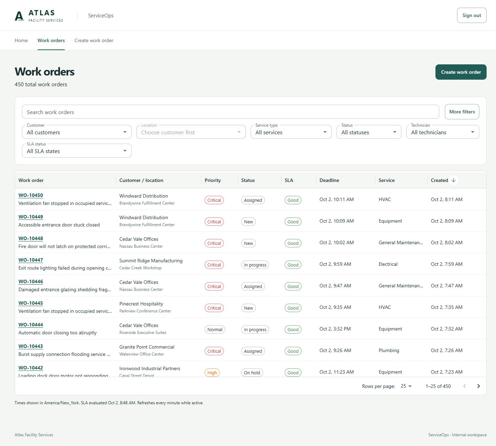
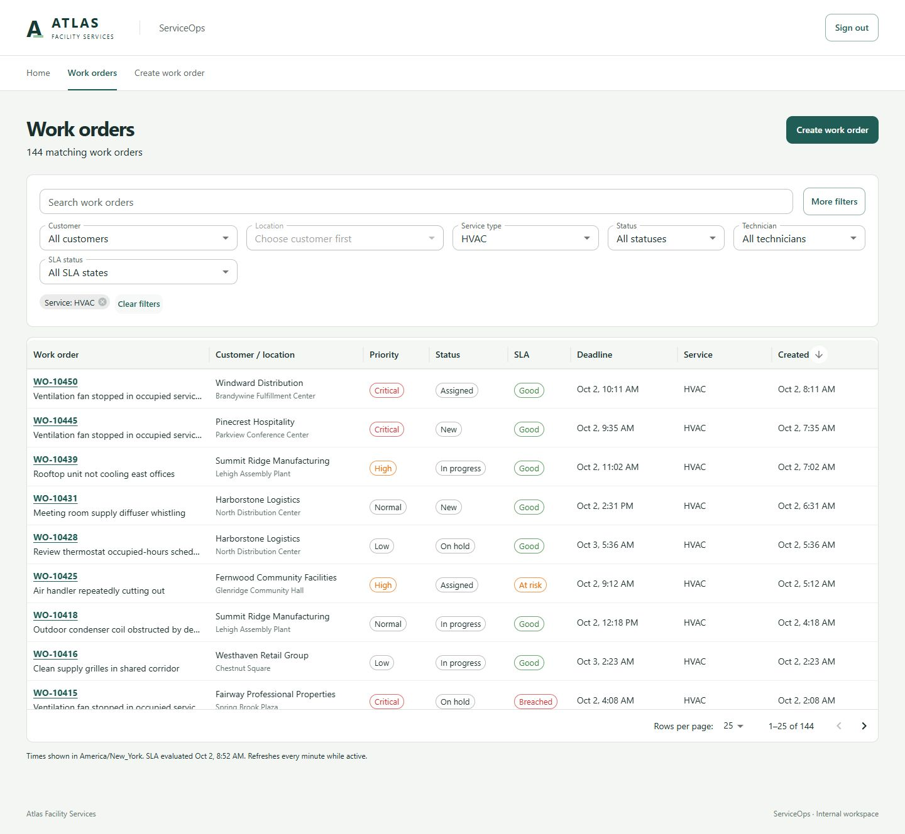
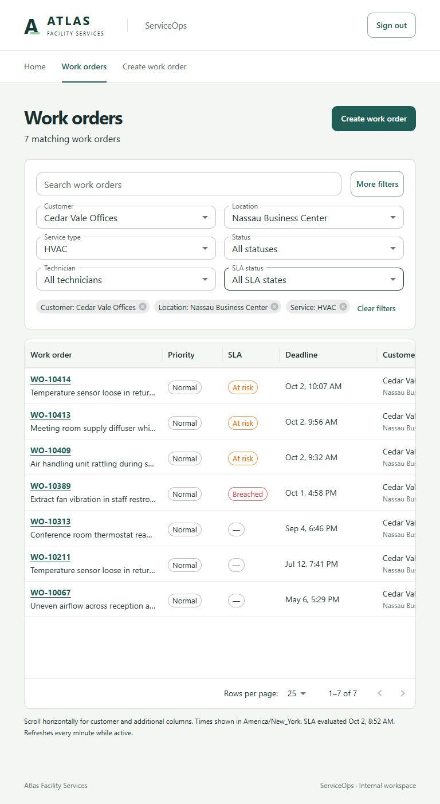
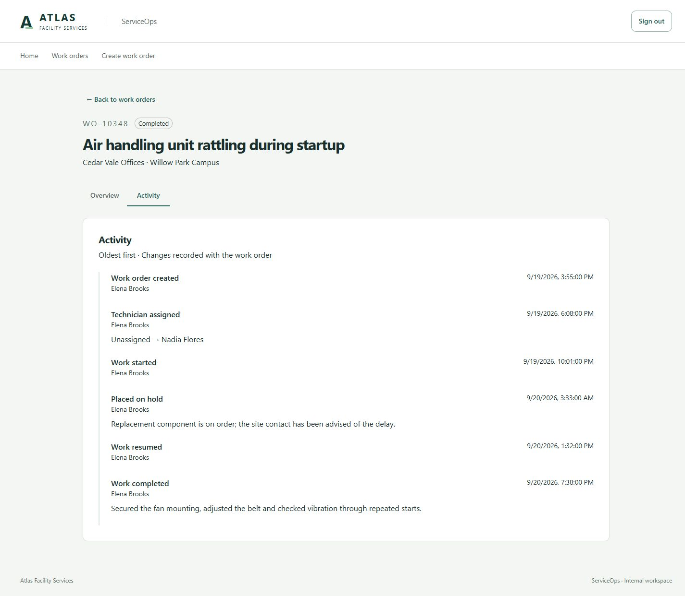

# Phase 5 review — Portfolio-quality demo dataset

October 2, 2026. Revised Phase 5 only, ready for review. No commit or push was made. The Manager Dashboard has not started. Priority changes, notes and the SLA background worker remain indefinitely deferred.

## 1. Exact seeded counts

| Entity | Count |
| --- | ---: |
| Customers | 20 |
| Locations | 50 |
| Technicians | 15 |
| Work orders | 450 |
| Work-order activities | 1,831 |
| Seeded login users | 2 |

All 50 locations and all 15 technicians are represented. Assigned work across technicians ranges from 14 to 49 orders, rather than an even rotation. Existing fictional reference names and stable IDs are retained.

## 2. Effective date range

The inspected fresh database used explicit reference instant **2026-10-02T12:30:00Z**. All counts below describe that dataset.

- Earliest creation: **2026-04-02T11:27:00Z**.
- Latest creation: **2026-10-02T12:11:00Z**.
- Earliest completion: **2026-04-02T13:05:00Z**.
- Latest completion: **2026-10-01T03:00:00Z**.
- Latest activity: **2026-10-02T12:12:00Z**.

The generator starts at midnight six calendar months before the chosen anchor. Historical creations are weighted toward weekdays. Open work includes a 12-day-old backlog example. The fixed default anchor is **2026-10-01T18:00:00Z**; the review deliberately used the documented explicit override near the actual review time. The default generation window begins April 1, 2026. A different anchor changes dates and can change historical distributions where weekday adjustment affects elapsed time.

## 3. Work orders by status

| Status | Count |
| --- | ---: |
| New | 13 |
| Assigned | 16 |
| InProgress | 32 |
| OnHold | 11 |
| Completed | 360 |
| Cancelled | 18 |

Completed work is 80% of the dataset; cancellation is 4%. The current open backlog is 72 orders.

## 4. Work orders by priority

| Priority | Count |
| --- | ---: |
| Critical | 20 |
| High | 89 |
| Normal | 258 |
| Low | 83 |

Normal is 57.3%; Critical is 4.4%. No priority mutation is generated or implemented.

## 5. Work orders by service type

| Service | Count |
| --- | ---: |
| HVAC | 144 |
| Electrical | 98 |
| Plumbing | 85 |
| Equipment | 72 |
| General Maintenance | 51 |

## 6. Open work by SLA state

| State | At reference instant, 12:30 UTC | Live evaluation, 12:48:01 UTC |
| --- | ---: | ---: |
| Good | 30 | 30 |
| AtRisk | 16 | 15 |
| Breached | 26 | 27 |
| Total | 72 | 72 |

Both evaluations are on October 2, 2026. Live API responses use the real server clock; these are timestamped observations, not permanently fixed counts. One order legitimately crossed its deadline during review. For a future demonstration, use a fresh database with an explicitly selected fixed anchor near that review. Rerunning an installed seed never rebases timestamps. Terminal orders are excluded from current SLA state.

## 7. Completed SLA outcomes

| Outcome | Count |
| --- | ---: |
| Met: CompletedAt <= SlaDeadlineAt | 280 |
| Missed: CompletedAt > SlaDeadlineAt | 80 |

Cancelled work has no completion outcome. The persisted timestamps support future dashboard queries without worker-maintained values. Current Operations and Period Performance remain distinct in the architecture; no dashboard query or endpoint was added.

## 8. Titles and descriptions

An authored catalog contains 85 service/priority-specific facilities issues, each with a title, concise context and matching completion summary. This dataset uses **84 distinct titles**. Descriptions add the actual site name and a short access instruction. Titles have no synthetic row numbers. Specialized assets such as loading docks, walk-in coolers and fitness equipment are restricted to suitable customer groups.

The first visual review found simultaneous duplicate faults at one site. Selection now prefers an unused title for that site's open work when an alternative exists; the final inspected dataset has no duplicate open title/location pairs. This is a small selection rule, not a general uniqueness framework. Recurring faults across sites and months are intentional.

## 9. Workflow and activity histories

Every order uses `WorkOrder.Create`, then the existing `Assign`, `StartWork`, `PlaceOnHold`, `Resume`, `Complete` or `Cancel` methods as appropriate. A private seed-only TimeProvider supplies ordered historical instants. The application's TimeProvider remains unchanged.

| Activity | Count |
| --- | ---: |
| Created | 450 |
| Assigned | 423 |
| Started | 403 |
| PlacedOnHold | 94 |
| Resumed | 83 |
| Completed | 360 |
| Cancelled | 18 |

Most completed work has a short four-event lifecycle; 83 completed orders include hold/resume. Eleven current orders remain OnHold with a reason. Four cancellations occurred after assignment; the others were cancelled before dispatch. Activities identify seeded Operations/Manager users. Completion summaries correspond to the selected issue, and all generated activity is at or before the reference instant.

## 10. Implementation approach and running it

The API's existing Development-only CLI now accepts **`--seed-demo`** and runs user, reference and portfolio seeding. The standalone **`--seed`** command remains useful for users/reference data only. The removed queue fixture is not an alternative demo generator.

The portfolio seeder uses a fixed random seed, a small authored catalog and direct domain calls. It saves orders chronologically inside one database transaction so fresh-database human numbers repeat as well as content. The sole schema addition is `DemoSeedStates`, containing version and anchor. No domain entity, business endpoint, frontend feature, project or package was added.

Follow README prerequisite/password setup, then use one of these workflows.

**Docker Compose, clean development database:**

```powershell
docker compose config --quiet
docker compose up --build -d
docker compose --profile tools run --rm -e DemoSeed__AnchorUtc=2026-10-02T12:30:00Z seed --seed-demo
```

Omit `-e DemoSeed__AnchorUtc=...` to use the fixed default. For a later review choose a deliberate new fixed UTC value on a fresh database. Open http://localhost:5173.

**Host, clean PostgreSQL database and README environment configured:**

```powershell
dotnet restore backend/ServiceOps.sln --locked-mode
dotnet build backend/ServiceOps.sln --no-restore
$env:DemoSeed__AnchorUtc = '2026-10-02T12:30:00Z'
dotnet run --project backend/src/ServiceOps.Api --no-build -- --migrate --seed-demo
dotnet run --project backend/src/ServiceOps.Api --no-build --urls http://127.0.0.1:5080
```

In another terminal:

```powershell
cd frontend
npm ci
npm run dev -- --host 127.0.0.1
```

The README includes connection-string and seeded-password environment setup. Use a separate empty development database if existing work orders must be retained. No automatic reset is provided.

## 11. Determinism and safe reruns

Fixed random seed `20261001`, ordered stable reference IDs, fixed anchor and chronological persistence produce repeatable business-visible data. Tests compare two independent fresh databases including order numbers, reference IDs, text, dates, actors and activity payloads. Generated UUIDs and password hashes are intentionally excluded.

The `portfolio-v1` marker commits with all work orders and activities. A matching rerun preserves all data, including user edits and added activities. An omitted anchor accepts the installed anchor. A different explicit anchor/version or pre-existing unmarked work orders produces an explanatory refusal. User/reference seeds retain their existing idempotent behavior.

A failed work-order insert rolls back all previously saved demo orders, activities and the marker. User/reference seeding occurs beforehand and can remain after a failure. PostgreSQL sequence values are not transactional, so a failed attempt may leave number gaps; exact numbering repeatability assumes a fresh database. This is a single-developer seed command, with no distributed or concurrent seed coordination.

## 12. Verification performed

| Check | Result |
| --- | --- |
| Backend build | Passed; zero errors, existing NU1900 vulnerability-feed warning |
| Backend domain tests | 17 passed |
| Backend PostgreSQL integration tests | 55 passed, including 4 new seed tests |
| Frontend tests | 16 passed |
| Frontend TypeScript check | Passed |
| Frontend production build | Passed; existing large-chunk advisory |
| Fresh migration + demo CLI | Passed on a new PostgreSQL database |
| CLI rerun without explicit anchor | Passed; installed data preserved |
| EF pending-model check | No pending model changes |
| Docker Compose configuration validation | Passed |
| Docker container execution | Not performed: Docker engine unavailable; host stack verified |
| Diff whitespace check | Passed |

The four seed tests cover distribution/domain invariants; fresh-database determinism and edit-preserving reruns; refusal of existing unmarked data/invalid anchor; and rollback after a later insert fails. The existing Phases 1–4 suites continue to cover authentication, roles, creation, filters, SLA boundaries, workflow and conflicts.

Manual browser review used real API/PostgreSQL data at desktop 1440px and tablet 768px. At 768px the document width remained 768px; additional table columns use the existing horizontal scrolling layout. Reviewed customer/site names, titles, priorities, SLA badges, technicians, dates and the following cases:

| Review | Observed result |
| --- | --- |
| Unfiltered queue | 450 orders with pagination |
| Completed / Cancelled filters | 360 / 18 orders |
| SLA AtRisk filter | 15 orders during inspection |
| Breached + Adrian Wallace | One matching order |
| Cedar Vale + Nassau Business Center + HVAC | Seven matching orders |
| HVAC filter | 144 orders |
| Number search + Completed | Found WO-10348 |
| Unassigned filter | Exposed New orders without technicians |
| WO-10449 | New, unassigned, Good |
| WO-10414 | Assigned, AtRisk, valid technician |
| WO-10419 | InProgress, Breached |
| WO-10424 | OnHold, AtRisk, hold reason and four-event history |
| WO-10380 / WO-10379 | Completed, Met, matching resolutions and coherent histories |
| WO-10348 | Completed, Missed, six-event hold/resume history |
| WO-10371 | Cancelled after assignment, reason present, SLA not applicable |

Terminal detail screens exposed no mutation actions. Existing filtering and back-to-queue URLs were exercised. No browser mutations were needed for this review.

## 13. Files added or changed

Added:

- `backend/src/ServiceOps.Api/Persistence/Seeding/PortfolioDemoSeed.cs`
- `backend/src/ServiceOps.Api/Persistence/Seeding/DemoIssueCatalog.cs`
- `backend/src/ServiceOps.Api/Persistence/Seeding/DemoSeedState.cs`
- `backend/src/ServiceOps.Api/Persistence/Migrations/20261002123253_PortfolioDemoMarker.cs` and its generated designer
- `backend/tests/ServiceOps.Api.IntegrationTests/PortfolioDemoSeedTests.cs`
- `PHASE5_REVIEW.md` and four images under `docs/screenshots/phase5/`

Changed: API `Program.cs`, `ServiceOpsDbContext.cs`, migration model snapshot, `README.md`, `ARCHITECTURE.md`, and `IMPLEMENTATION.md`. The documents now reflect the revised remaining phases and indefinite deferrals. No dependency or lockfile changed.

## 14. Removed queue-fixture approach

Removed `Persistence/Seeding/QueueReviewFixture.cs`, its generation call and the old README population instructions. `--seed-queue` now fails with a clear message directing developers to `--seed-demo`; it cannot silently start the API. The earlier Phase 3 review remains an historical record. Automated-test-specific fixtures were retained.

## 15. Deviations and limitations

No deviation from the revised Phase 5 scope. The added marker table is the minimal persistent state needed to distinguish an installed demo from unrelated work while preserving edits. It is not used by runtime business logic.

The dataset is deliberately authored and weighted, not a workforce simulation: technician capacity, seasonality, exact site asset inventories and business-hour scheduling are not modeled. SLA rules remain the accepted 24/7 calendar rules. Critical orders appear disproportionately near the newest end of the live backlog because their SLA durations are shortest; they remain uncommon overall. The backlog naturally ages, so future reviews need a fresh database and explicitly chosen anchor to demonstrate all live states.

NuGet vulnerability-feed access could not be verified in this environment; builds used restored dependencies and emitted NU1900. The unchanged frontend build emits a bundle-size advisory. Docker configuration was validated but container startup was not executed without an engine. The host application, real database, migrations, seed and browser paths were exercised instead. MUI emitted a transient zero-width grid warning during browser viewport changes; the settled desktop and tablet layouts rendered correctly. Temporary review servers were stopped after verification.

Final diff review found no new framework, dependency, bypassed domain rule, credential, local database file, dashboard, priority mutation, notes, worker, AWS or administration feature. No commit or push was performed. Stop here for review.

## 16. Screenshots

Populated unfiltered desktop queue:



HVAC filter showing varied open states:



Customer/location/service filters at 768px:



Completed hold/resume activity:


