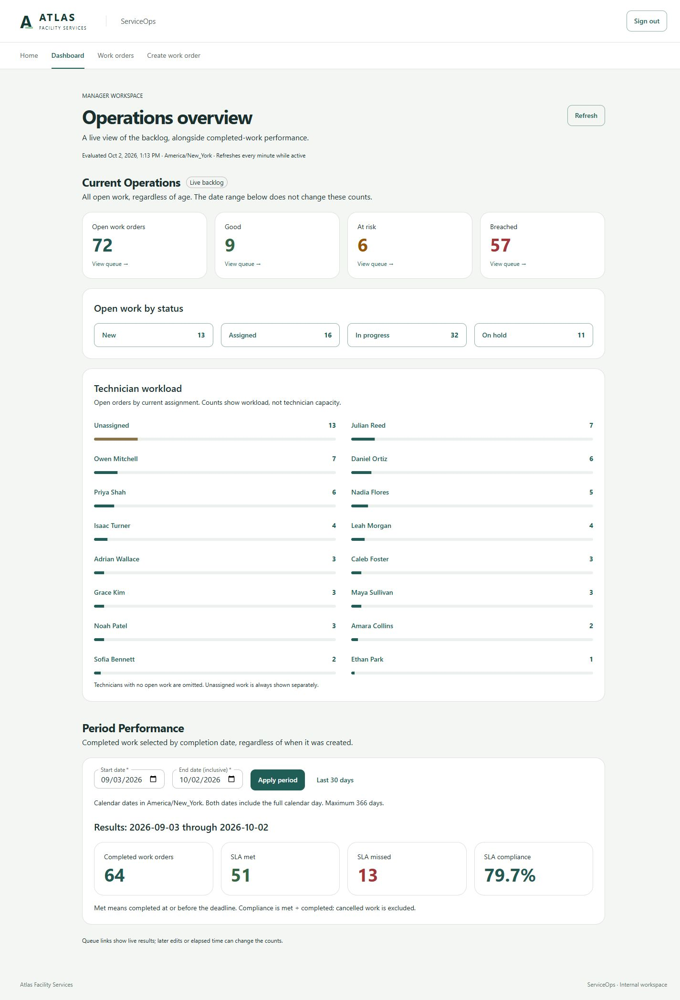
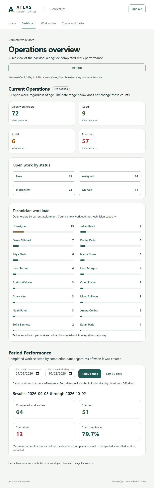
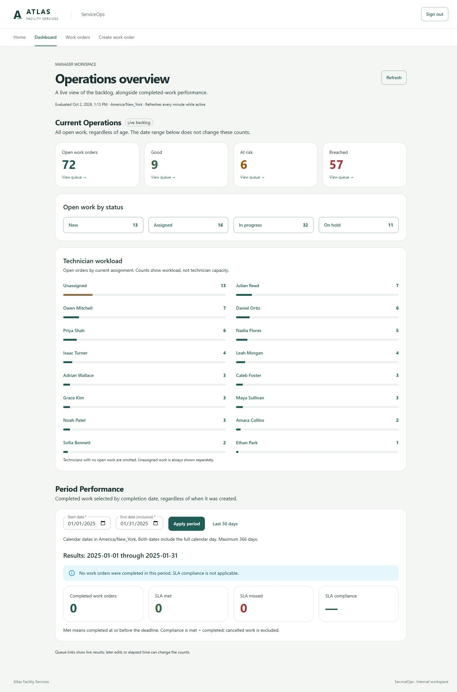
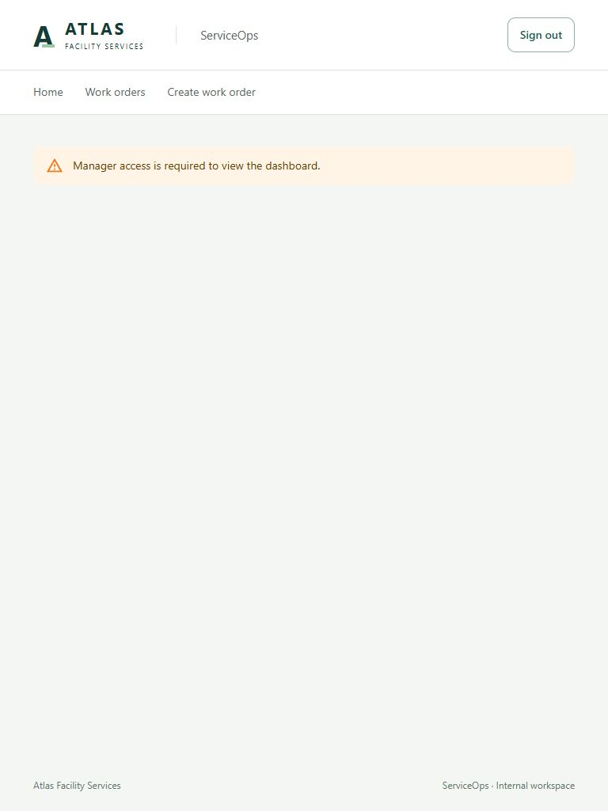

# Phase 6 review — Manager Dashboard

October 2, 2026. Implemented and verified; awaiting review. No commit or push was made. Phase 7 has not begun.

## Delivered scope

A Manager-only dashboard separates the live open backlog from completion-period performance. The API enforces the existing Manager policy; anonymous requests receive 401 and Operations requests receive 403. The frontend hides Dashboard navigation from Operations and blocks direct navigation with an access message.

The October 2 request supersedes the earlier broader Phase 6 plan. ARCHITECTURE.md and IMPLEMENTATION.md now reflect the focused scope: no customer/service filters, charts, trends, mean-resolution metric, attention table or new drill-through infrastructure. Compliance is included as explicitly requested. No other material deviation from the revised scope was needed.

## Exact metric definitions

| Metric | Definition |
| --- | --- |
| Open backlog | All New, Assigned, InProgress and OnHold orders, regardless of creation date or selected performance period. Completed and Cancelled are excluded. |
| Open status counts | The same open cohort grouped by its current status. Their sum equals open backlog. |
| Good | Open orders where evaluatedAt < SlaAtRiskAt. |
| AtRisk | Open orders where SlaAtRiskAt <= evaluatedAt < SlaDeadlineAt. |
| Breached | Open orders where evaluatedAt >= SlaDeadlineAt. Good + AtRisk + Breached equals open backlog. |
| Technician workload | Open orders grouped by current technician ID/name. Unassigned is separate and always shown, even at zero. Technicians with zero open work are omitted. Counts sum to open backlog; bars show each group's share of backlog, not capacity. |
| Completed | Status Completed and FromUtc <= CompletedAt < ToUtc. Creation date has no effect. Cancelled orders never enter this cohort. |
| SLA met | Completed cohort where CompletedAt <= SlaDeadlineAt, including exact equality. |
| SLA missed | Completed minus met, equivalently completion after the persisted deadline. |
| SLA compliance | 100 × met / completed, rounded to one decimal with midpoint rounding away from zero. Empty periods return null and display an em dash, with an explanatory empty state. |

The reporting timezone is **America/New_York**, independent of browser timezone. Both visible date inputs include the full calendar day. Internally, the API uses an inclusive start and exclusive end, converting each local midnight independently to UTC so 23-hour and 25-hour DST days are respected. Default: the last 30 calendar days including today in the reporting timezone. Current Operations never uses the period filter.

`GET /api/v1/dashboard` accepts either no query parameters or both `startDate` and `endDateExclusive`, each a single `yyyy-MM-dd` value. Example: `?startDate=2026-09-01&endDateExclusive=2026-10-01` includes September. Period length must be 1–366 calendar days; accepted boundaries fall in years 1900–2100. Consequently, the latest inclusive UI end date is December 30, 2100. Missing pairs, repeated/unsupported parameters, malformed dates and invalid ranges return validation Problem Details.

## Implementation and architectural decisions

- One captured `TimeProvider.GetUtcNow()` value evaluates every current SLA count and supplies the response evaluation time and default reporting dates.
- Three direct EF Core/Npgsql aggregates calculate current status/SLA counts, workload groups and completion outcomes. A short repeatable-read transaction gives these queries a consistent database snapshot. No individual work-order dataset is returned or aggregated in the browser.
- The controller and response records remain in one Dashboard feature file. No reporting service framework, repository, cache, counters, worker, migrations or new indexes were introduced.
- Material UI cards, status links and workload bars reuse existing dependencies. TanStack Query refreshes every minute while active and on focus, with manual Refresh. Successful existing work-order mutations invalidate dashboard queries; sign-out clears them.
- Current cards/status/workload link to supported queue filters using `openOnly=true` plus SLA/status/technician/unassigned as applicable. Completed cards have no links because the existing queue does not support completion-date filtering. Later edits or elapsed time can change queue counts after a dashboard snapshot.
- Generated OpenAPI TypeScript types are used by the dashboard client. Loading, retryable errors, date validation, no-backlog and no-completion states are included. Applied dates are shown separately from draft form values.
- Priority changes, notes, the SLA worker, AWS and administration remain deferred. No dependency or lockfile changes.

## Files

Added:

- `backend/src/ServiceOps.Api/Features/Dashboard/DashboardController.cs`
- `backend/tests/ServiceOps.Api.IntegrationTests/DashboardTests.cs`
- `frontend/src/features/dashboard/DashboardPage.tsx`
- `frontend/src/features/dashboard/DashboardPage.test.tsx`
- `frontend/src/features/dashboard/api.ts`
- `PHASE6_REVIEW.md` and `docs/screenshots/phase6/*.png`

Updated: frontend App routing/navigation, existing create/workflow mutation cache invalidation, generated API schema, README.md, ARCHITECTURE.md and IMPLEMENTATION.md. No new projects were created.

## Verification results

| Check | Result |
| --- | --- |
| Backend build and full tests against PostgreSQL 18.6 | Passed: 17 domain + 59 integration = **76 tests**, zero failures. `dotnet test backend/ServiceOps.sln --no-restore` rebuilt the projects. |
| Dashboard API integration coverage | Four focused tests cover Manager/anonymous/Operations access, open/terminal separation, exact risk/deadline boundaries, old backlog, creation-independent completion selection, inclusive/exclusive boundaries, met-at-deadline, cancellations, empty periods, invalid inputs, DST and queue-total reconciliation. |
| Frontend tests | `npm test`: **22 passed**, including six dashboard tests for role navigation/route protection, loading, date conversion/validation/reset, cohort display/links, errors/retry and empty periods. |
| TypeScript and production frontend build | `npm run typecheck` and `npm run build` passed. The build also runs type checking. |
| Generated contract | `npm run api:generate` succeeded against the running development API. A second generation produced the identical schema hash. |
| Real browser/API/PostgreSQL | Manager login and dashboard reviewed at 1440px desktop and 768px tablet widths. Tablet document width equalled viewport width, with no horizontal overflow. |
| Date controls and errors | Applied April 1–October 2 and an empty January 2025 period; Last 30 days restored the default. Invalid API date parameters displayed the validation error and recovery worked. Current backlog stayed 72 while changing the period. |
| Queue links | Browser navigation confirmed AtRisk = 6, OnHold = 11, Unassigned = 13 and Julian Reed = 7, with intended URL filters. Fixed-clock integration tests reconcile every status/SLA/workload link predicate. |
| Operations browser access | Dashboard navigation absent; direct `/dashboard` showed Manager-required access message without dashboard data. |
| Scope/diff | Reviewed new feature files and changes for premature abstractions. `git diff --check` passed. No dependency, migration or seed-source changes. |

### Existing seeded data reconciliation

Used the installed `serviceops_phase5_review` database, with **450 orders**, **1,831 activities** and its existing `portfolio-v1` anchor **2026-10-02T12:30:00Z**. No seeding or rebasing was performed.

At **2026-10-02 13:08:39 America/New_York (17:08:39Z)**:

| View | Observed values |
| --- | --- |
| Open statuses | 13 New + 16 Assigned + 32 InProgress + 11 OnHold = **72** |
| Open SLA | 9 Good + 6 AtRisk + 57 Breached = **72** |
| Workload | 13 unassigned + 59 assigned = **72** |
| Default September 3–October 2 inclusive | **64 completed = 51 met + 13 missed; 79.7%** |
| April 1–October 2 inclusive | **360 completed = 280 met + 80 missed; 77.8%** |
| January 2025 | **0 completed, 0 met, 0 missed; compliance not applicable** |

Default UTC boundaries were September 3 at 04:00Z through October 3 at 04:00Z. Independent SQL agreed with the default completion totals. Live SLA counts naturally age and need not match these screenshots later.

Before/after fingerprints of ordered full-row JSON matched: WorkOrders `ebca22e8f28c9e69f72d2abd050a2b61`; WorkOrderActivities `dbca46ba5f9f8b5dc423e4e821037fe3`. Counts and the seed marker/anchor were unchanged. Integration tests used their own temporary databases.

### Query review

Representative equivalent aggregate SQL was inspected with `EXPLAIN (ANALYZE, BUFFERS)` on the existing 450-order database. Execution times were approximately 0.177 ms for current totals, 0.155 ms for workload and 0.085 ms for completion outcomes. The small sequential scans were appropriate; no additional index was justified. Three warmed localhost API requests took 6, 4 and 4 ms with about a 2 KB response. These are local observations, not production benchmarks or load tests.

## Screenshots

### Desktop — 1440px



### Tablet — 768px



### Empty completion period



### Operations access denied



## Run and review locally

Phase 6 requires no migration or seed rerun. Preserve the existing database and `.env`. Use the README's normal host or Docker startup configuration. For an already configured host terminal, from the repository root:

```powershell
dotnet build backend/ServiceOps.sln --no-restore
dotnet run --project backend/src/ServiceOps.Api --no-build --urls http://127.0.0.1:5080
```

In a second terminal:

```powershell
cd frontend
npm run dev -- --host 127.0.0.1
```

The API terminal must have `ASPNETCORE_ENVIRONMENT=Development` and `ConnectionStrings__ServiceOps` set to the existing database, as documented in README.md. Open http://localhost:5173 and sign in as `marcus.chen@atlas.example` with the installed Manager password. Choose Dashboard, change the period, follow current queue links, then sign in as Operations to check role behavior. No passwords are included in this report.

For tests, configure `TEST_DATABASE_CONNECTION` to a local PostgreSQL server/account with CREATEDB permission, then run:

```powershell
dotnet test backend/ServiceOps.sln --no-restore
cd frontend
npm test
npm run typecheck
npm run build
```

## Limitations and existing technical debt

- NuGet emitted NU1900 because vulnerability-feed access was unavailable. Compilation and tests passed; package vulnerability auditing was not verified.
- Vite retained its large-chunk warning (about 1,121 KB, 339 KB gzip). No chart dependency was added. Bundle splitting remains a later, measured polish decision.
- Review used host API/Vite and real PostgreSQL. Docker containers were not run because no Docker engine was available; startup infrastructure was unchanged. GitHub CI was not run from this workspace.
- No production load test, full accessibility audit or cross-browser matrix was performed. Desktop/tablet review and focused component/API tests are the evidence supplied here.
- Reporting timezone is a fixed application decision; timezone selection, exports, extra analytics filters and completion drill-down are intentionally absent.

Changes remain uncommitted for review.
