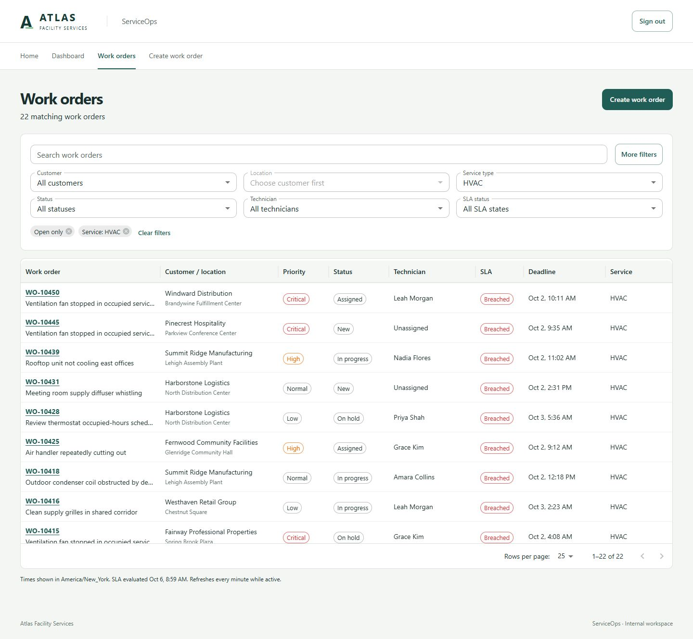
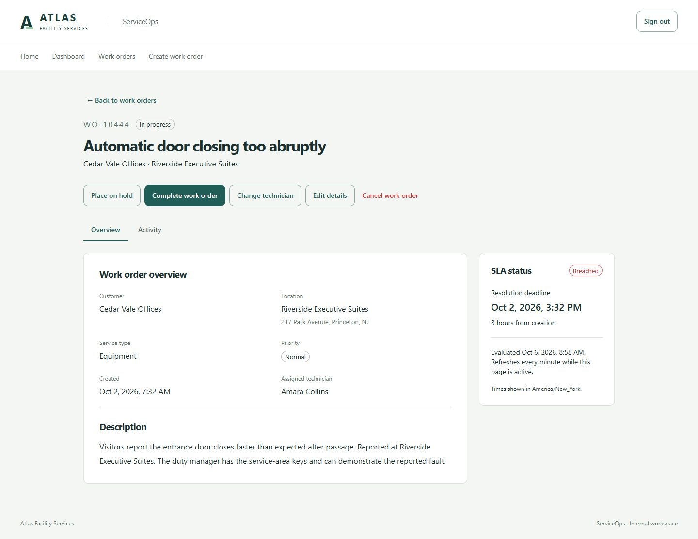
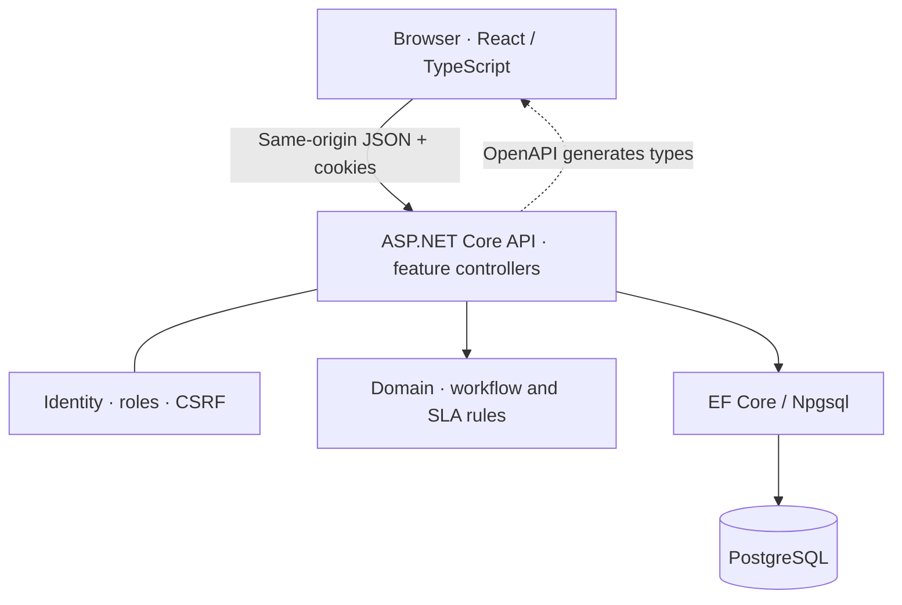

# ServiceOps

**A full-stack operations and work-order application for a fictional commercial facility-services company.**

ServiceOps brings service intake, technician assignment, workflow and SLA visibility into one internal workspace. Built from business requirements through domain design, API development, interface design and testing, it demonstrates a practical approach to building a credible business application without unnecessary infrastructure.

## Screenshots

**Manager Dashboard** — current operational workload and completion-period SLA performance, with distinct date semantics.


**Work Orders** — searchable, filterable operations queue with server-side pagination and URL-owned state.



**Work Order Detail** — business context, assignment, workflow actions and resolution deadlines.



[Activity timeline](docs/screenshots/portfolio/activity-desktop.png) · [Verification and limitations](docs/FINAL_REVIEW.md)

## Business problem

Atlas Facility Services manages maintenance and repair requests across customer locations. Operations staff need to know what needs attention, who owns each request and what has happened so far. Managers need a reliable view of the live backlog and completed SLA outcomes.

ServiceOps centralizes that work: intake, assignment, status transitions, deadline visibility, searchable records and an activity history that stays consistent with each change.

## Key features

- **Two roles:** Operations manages work; Managers also access the dashboard. Authorization is enforced by the API.
- **Work-order intake and detail:** dependent customer/location selection, service and priority, calculated SLA deadlines and readable business context.
- **Operations queue:** search, combined filters, sorting, pagination and shareable URLs; return from detail preserves queue context.
- **Explicit workflow:** assign, start, hold, resume, complete or cancel; required reasons and summaries, terminal-state protection and title/description correction.
- **Activity history:** chronological changes with actor, timestamp and relevant before/after values.
- **Manager Dashboard:** current backlog/status/SLA counts and technician workload, separate from completion-date-based met/missed/compliance metrics.
- **Conflict handling:** stale edits receive a clear conflict response; the interface retains the draft for review instead of silently overwriting work.

## Technology

| Layer | Technologies |
| --- | --- |
| Frontend | React, TypeScript, Material UI, MUI X Data Grid Community, TanStack Query, React Router, Vite |
| Backend | C#, ASP.NET Core, ASP.NET Core Identity, Entity Framework Core, Npgsql |
| Data | PostgreSQL |
| Development and delivery | Docker/Compose configuration, OpenAPI-generated TypeScript contracts, GitHub Actions workflow |
| Tests | xUnit, ASP.NET Core integration test host with real PostgreSQL, Vitest, Testing Library |

Versions are pinned in project files, lockfiles, `global.json` and Dockerfiles. No paid grid or charting package is required.

## Architecture

A modular monolith: a React SPA, one ASP.NET Core API and one PostgreSQL database. Feature controllers use EF Core directly; a dependency-free Domain project owns business rules. Identity supplies cookie authentication and role authorization. Work-order mutations and activity persist atomically.



Docker Compose describes the local web/API/database stack and explicit migration/seed commands. It is a development setup, not a claim of public production hosting. See [ARCHITECTURE.md](ARCHITECTURE.md) for the implemented design and metric definitions.

## Engineering highlights

- **Business operations, not generic status setters.** Domain methods enforce assignment, transition, reason and terminal-state rules.
- **Database-backed optimistic concurrency.** An EF concurrency token and optional expected revision produce HTTP 409 conflicts; the UI always supplies its known revision.
- **Atomic activity persistence.** Business changes and their append-only activity records commit together.
- **Derived SLA state.** Persisted creation/risk/deadline timestamps and one server reference instant determine current state. Correctness never depends on a worker.
- **Explicit reporting cohorts.** Current Operations includes all open work; Period Performance selects by CompletedAt, with New York calendar boundaries and meaningful empty-period behavior.
- **Server-side data work.** Filtering, sorting, pagination and dashboard aggregation run in PostgreSQL; the browser never downloads all orders to calculate metrics.
- **Reproducible evaluation.** Deterministic fictional demo history and real-PostgreSQL integration tests exercise the same constraints and query behavior as the application.
- **Focused frontend delivery.** Dashboard, queue, creation and detail load as separate route chunks; the app shell stays visible during navigation.

## Demo data

All companies, people, locations and work orders are fictional. The demo contains **450 work orders spanning roughly six months**, 20 customers, 50 locations and 15 technicians, with plausible assignment and workflow histories. It makes the product easy to evaluate without entering hundreds of records.

Seeding uses a fixed reference date and preserves installed records on reruns. Open SLA states use real server time, so historical demo backlog eventually becomes breached; this is expected. The application never freezes its clock or silently rebases existing data. See [demo data and time](docs/DEVELOPMENT.md#demo-dataset-and-time) for choosing a fixed anchor on a fresh database.

## Running locally

The simplest configured path is Docker Desktop with Linux containers and Docker Compose. From the repository root in PowerShell:

```powershell
# First setup only; preserve an existing .env.
Copy-Item .env.example .env
notepad .env
```

Fill the database and both demo-user passwords. Demo-user passwords need at least 12 characters, uppercase, lowercase, a digit and punctuation. Avoid semicolons in the database password. No passwords are stored in source control.

```powershell
docker compose config --quiet
docker compose up --build -d
docker compose --profile tools run --rm seed --seed-demo
```

Open **http://localhost:5173**. Sign in using the password configured for the chosen account:

| Account | Role | Password setting |
| --- | --- | --- |
| marcus.chen@atlas.example | Manager | SEED_MANAGER_PASSWORD |
| elena.brooks@atlas.example | Operations | SEED_OPERATIONS_PASSWORD |

On an existing installation, `docker compose up --build -d` is enough for this polish update; no seed rerun or migration is required. `docker compose down` preserves the database. Seed reruns do not reset user passwords or edited work orders.

[Full development guide](docs/DEVELOPMENT.md) includes host .NET/Node startup, migrations, configuration, troubleshooting and database lifecycle. Compose configuration is validated locally; container runtime execution and GitHub Actions execution have not been verified in this workspace.

## Testing

With .NET 10, Node 24 and a local PostgreSQL account configured as described in the development guide:

```powershell
dotnet restore backend/ServiceOps.sln --locked-mode
dotnet build backend/ServiceOps.sln --no-restore
# TEST_DATABASE_CONNECTION must identify a local PostgreSQL server with CREATEDB permission.
dotnet test backend/ServiceOps.sln --no-build
cd frontend
npm ci
npm test
npm run typecheck
npm run build
```

Domain tests cover workflow and SLA rules. API integration tests use temporary PostgreSQL databases for authentication, validation, filtering, concurrency, persistence, seeding and metric definitions. Frontend tests focus on forms, URL state, conflicts and dashboard behavior. With the development API running, `npm run api:generate` regenerates the checked-in contract; `git diff --exit-code -- src/lib/api/schema.d.ts` checks drift.

See [final review](docs/FINAL_REVIEW.md) for performed checks, bundle measurements, screenshots and known limitations. [IMPLEMENTATION.md](IMPLEMENTATION.md) records the completed phases and deliberate scope exclusions.
