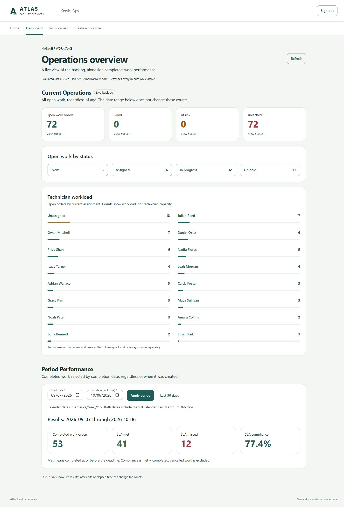

# Final portfolio and delivery review

October 6, 2026. Final implementation phase complete; awaiting owner review. No commit or push was created. Base commit: `e324e3e` (`feat: add manager operations dashboard`).

## Final functionality

ServiceOps is a fictional facility-services internal application: seeded Operations/Manager sign-in, work-order intake and detail, search/filter/sort/pagination, technician assignment, explicit workflow, title/description correction, revision conflicts, chronological activity, derived SLA state and a Manager-only dashboard. Current Operations and Period Performance remain distinct.

**No new product functionality was added. No deferred features were implemented.** Priority changes, notes, SLA background events, notifications, extra analytics, exports, administration, scheduling, billing, AWS and production hosting remain intentionally excluded. No dependency, backend business-code, database-schema or generator changes were made.

## Portfolio presentation and documentation

README now leads with the project and three application screenshots, followed by the business problem, implemented features, actual technology, architecture diagram, engineering highlights, fictional demo data, startup, testing and a clear portfolio notice. It includes a reusable project description without an AWS or public-deployment claim.

`docs/DEVELOPMENT.md` preserves detailed Compose and host-development commands, configuration, migration/seed behavior, tests and demo-data aging outside the landing page. `ARCHITECTURE.md` was corrected in place: actual feature folders, local form state instead of uninstalled form libraries, actual indexes, actual CI checks and no invented production hosting/automated browser suite. `IMPLEMENTATION.md` records accepted Phases 1–6 and final polish, and explicitly removes the original priority/notes/worker phases from portfolio scope. The obsolete Domain README now describes the delivered workflow model.

The README Mermaid diagram shows React → API → domain/EF → PostgreSQL, with Identity/CSRF and the generated OpenAPI contract. It is intentionally small.

## UI polish

- Six queue filters now form two balanced desktop rows of three; tablet remains two columns.
- Technician assignment appears beside status in the desktop queue instead of beyond the main visible columns. The tablet grid retains its focused leading columns and internal horizontal scrolling.
- Activity uses the same medium-date/short-time format as detail and explicitly names the browser timezone.
- Hold and terminal notices have separation from the preceding detail fields.
- Dashboard, queue, creation and detail use standard React.lazy imports, with a single accessible loading state inside the persistent application shell. No bundler framework or manual chunk scheme was introduced.

The existing restrained visual direction, workflow actions, badges and dashboard hierarchy were preserved. No redesign was needed.

## Bundle measurements

Vite production build output (decimal KB):

| JavaScript | Before | After |
| --- | ---: | ---: |
| Initial entry, minified | 1,121.24 KB | 538.30 KB |
| Initial entry, gzip | 338.91 KB | 168.57 KB |
| Queue route, deferred | Included above | 519.03 KB / 154.28 KB gzip |
| Dashboard route, deferred | Included above | 10.62 KB / 3.91 KB gzip |
| Detail route, deferred | Included above | 23.86 KB / 7.31 KB gzip |
| Creation route, deferred | Included above | 7.22 KB / 2.48 KB gzip |

Initial JavaScript fell about **52% minified / 50% gzip**. Shared lazy chunks also exist; route numbers are not the full cost of first visiting that route. This improves initial delivery, not the total code downloaded by someone visiting every page. Vite still advises that the initial and grid chunks exceed 500 KB; custom chunk configuration was not justified.

## Verification performed

| Check | Result |
| --- | --- |
| Backend build | Passed, zero errors. Existing NU1900 vulnerability-feed warning remains. |
| Domain tests | 17 passed. |
| PostgreSQL API integration tests | 59 passed. Real PostgreSQL 18.6, temporary databases. |
| Frontend suite | 22 passed across five files, rerun after final UI changes. |
| TypeScript | Explicit type check passed; final production build also type-checked. |
| Production frontend build | Passed with the size advisory described above. |
| OpenAPI generation/drift | Generated against the running API; `git diff --exit-code -- frontend/src/lib/api/schema.d.ts` passed with no changes. |
| Compose configuration | Standalone Docker Compose `config --quiet` passed with a nonsecret validation-only database password. |
| Whitespace/diff | `git diff --check` passed. Scope reviewed; no dependency or schema changes. |
| Browser console | No warning/error entries recorded during the successful smoke journeys, including production-preview route checks. |

The existing suites include authorization, CSRF, workflow/SLA boundaries, creation, filtering, revision conflicts, transactional activity, seed determinism/idempotency and dashboard cohort/date rules. No new tests were added for spacing or equivalent column ordering; existing regression tests and browser checks cover the changed surfaces.

### Browser review

Used the real API and a PostgreSQL copy of the installed realistic dataset, at **1440 × 1050 desktop** and **768 × 1024 tablet**.

- Manager: login → Dashboard → open backlog queue link (72 matching orders) → representative detail → Activity → Back to work orders. The return URL retained `openOnly=true`.
- Queue: title search, no-result state, clearing filters, HVAC filter/chips, second-page navigation, detail links and tablet layout. Technician, priority/status/SLA badges and pagination were visually reviewed.
- Operations: login (no Dashboard navigation) → create WO-10451 → assign Amara Collins → start → hold with reason → resume → complete with summary → Activity. All six expected entries remained after refresh, and terminal actions disappeared.
- Desktop detail and tablet creation/detail/dialogs/terminal presentation reviewed. Dashboard and queue had no document-level horizontal overflow at 768px; the data grid intentionally scrolls internally.
- Empty dashboard period showed zero counts and an em dash; Last 30 days recovered the default. Current backlog remained independent of the period.
- Dashboard, queue, create and detail/activity refreshes worked. These route checks were repeated against the built assets served by Vite preview, not only the development server.
- Loading and error/conflict states were reviewed in code and passing component tests; the final browser pass exercised no-results and no-completions states. A separate two-tab conflict simulation and full accessibility/cross-browser audit were not repeated in this phase.

The browser tool initially could not attach to a saved error page. After the owner opened the working local login page, the review completed normally. A turn-scoped filesystem permission also expired mid-task; it was renewed and affected frontend checks were rerun successfully. These were environment interruptions, not application failures.

### Dataset sanity and preservation

Original database: **450 orders**, **1,831 activities**, **20 customers**, **50 locations**, **15 technicians**. Statuses: 360 Completed, 18 Cancelled, 13 New, 16 Assigned, 32 InProgress and 11 OnHold. Version remains `portfolio-v1`, anchor `2026-10-02T12:30:00Z`.

Original full-row ordered fingerprints remain unchanged: WorkOrders `ebca22e8f28c9e69f72d2abd050a2b61`; activities `dbca46ba5f9f8b5dc423e4e821037fe3`. No seed rerun/rebase was performed. The separate `serviceops_final_review` copy contains 451 orders and 1,837 activities after the manual lifecycle; it is local, not a committed database artifact.

Portfolio screenshots were captured before that test order was created. On October 6 the original open cohort was 72 Breached / 0 Good / 0 AtRisk, because it uses real server time against the fixed seed. Default September 7–October 6 performance was 53 completed, 41 met, 12 missed, 77.4%. Counts are evidence at capture time, not promises of future live values.

## Screenshots produced

All depict fictional seeded records and contain no passwords:

- `docs/screenshots/portfolio/dashboard-desktop.png` — primary README image, both dashboard sections.
- `docs/screenshots/portfolio/queue-desktop.png` — open HVAC queue, 22 matching orders, assignment visible.
- `docs/screenshots/portfolio/detail-desktop.png` — WO-10444, an in-progress equipment request.
- `docs/screenshots/portfolio/activity-desktop.png` — its creation, assignment and start history.
- `docs/screenshots/portfolio/dashboard-tablet.png` — 768px review evidence.



## Repository cleanup

No tracked scratch scripts, database dumps, local tooling, build output, `.env`, editor artifacts or obsolete queue fixture implementation were found. Existing ignored node_modules/bin/obj/dist folders are normal local build products, not repository deliverables. Useful phase review reports and their referenced screenshots were retained as historical evidence rather than deleted to reduce file count; the implementation record identifies them as historical.

Removed stale proposed-architecture claims and obsolete phase wording in the Domain README/activity comment. Expanded Git and Docker ignores to cover `.env.*` (keeping `.env.example`), logs and database dump/backup files. New final screenshots live together in a dedicated directory.

## Security/configuration sanity

- No real secrets or private credentials were found in the tracked source/docs examined. Credential-pattern scan across tracked text found no private keys, common access tokens, or local review passwords. Git history filename review found no `.env`, key/dump/log artifacts. This was a practical review, not an exhaustive secret-scanning certification of every historical blob.
- Only `.env.example` exists at the repository root; its password fields are blank. DemoUsers reads configured passwords and does not reset existing hashes on reruns. Hard-coded CI/test passwords are isolated test-only values, not deployed credentials.
- API policies enforce Operations/Manager access; dashboard requires Manager. Frontend navigation is not the security boundary.
- Login/logout and business mutations explicitly validate antiforgery tokens. Cookies are HttpOnly and Secure outside Development. Identity hashing, lockout and login rate limiting remain intact.
- OpenAPI is mapped only in Development. Exception handling uses Problem Details without a developer exception page. Source connection settings have no real embedded credentials; Compose interpolates environment values.
- Compose binds exposed ports to loopback and is explicitly a Development configuration. It should not be published as a hardened Internet deployment.

**Public repository readiness:** Ready for owner review and publication as a fictional portfolio repository on the evidence above. No customer/proprietary production data was found. This does not mean the local development stack is ready for public production hosting.

## Docker, CI and remaining limitations

- **Docker:** configuration validated; no Docker engine was available, so images/containers were not built or run in this environment. Human runtime verification remains outstanding.
- **GitHub Actions:** workflow inspected; remote execution was not verified. No claim of a green hosted CI run is made.
- NuGet vulnerability-feed access was unavailable (NU1900); dependency vulnerability auditing is unverified. No dependencies were added.
- Large initial/grid chunks remain advisory, despite substantial initial-load improvement.
- No public hosting, production SPA-serving profile, persistent container data-protection keys, full accessibility audit, penetration test, production load test or cross-browser matrix is included. API restarts can require sign-in again.
- Fixed seed data naturally ages. Choose a deliberate fixed anchor only when installing into a fresh review database; never rebase an installed dataset.

## Files most important to review

1. `README.md` — prospective-client landing page, diagram, screenshots and project description.
2. `docs/DEVELOPMENT.md` — exact local setup and test commands.
3. `ARCHITECTURE.md` and `IMPLEMENTATION.md` — accurate delivered architecture and scope.
4. `frontend/src/app/App.tsx` — four lazy routes and shell loading state.
5. `frontend/src/features/work-orders/WorkOrdersPage.tsx`, `WorkOrderActivity.tsx`, `WorkOrderDetailPage.tsx`, and `frontend/src/styles.css` — bounded presentation changes.
6. `docs/screenshots/portfolio/` — final screenshot set.
7. `.gitignore`, `.dockerignore`, `frontend/.dockerignore` — local artifact exclusions.

Suggested commit message, **not executed**:

```text
chore: polish ServiceOps portfolio presentation and delivery documentation
```

## Exact local commands

From the repository root, first-time Docker setup in PowerShell:

```powershell
Copy-Item .env.example .env  # First setup only; do not overwrite an existing .env.
notepad .env                # Supply the three private passwords.
docker compose config --quiet
docker compose up --build -d
docker compose --profile tools run --rm seed --seed-demo
```

Open http://localhost:5173. Manager: `marcus.chen@atlas.example`; Operations: `elena.brooks@atlas.example`. Use the corresponding password you configured in `.env`.

For an existing installed database, this phase needs only:

```powershell
docker compose up --build -d
```

Host development instead (PostgreSQL running, .NET 10/Node 24 installed), from the root in terminal 1:

```powershell
Get-Content .env | Where-Object { $_ -match '^[A-Z_]+=' } | ForEach-Object {
    $key, $value = $_ -split '=', 2
    Set-Item -Path "Env:$key" -Value $value
}
$env:ASPNETCORE_ENVIRONMENT = 'Development'
$env:ConnectionStrings__ServiceOps = "Host=localhost;Port=5432;Database=serviceops;Username=serviceops;Password=$env:POSTGRES_PASSWORD"
$env:Seed__OperationsPassword = $env:SEED_OPERATIONS_PASSWORD
$env:Seed__ManagerPassword = $env:SEED_MANAGER_PASSWORD
dotnet restore backend/ServiceOps.sln --locked-mode
dotnet build backend/ServiceOps.sln --no-restore
# First installation only:
# dotnet run --project backend/src/ServiceOps.Api --no-build -- --migrate --seed-demo
dotnet run --project backend/src/ServiceOps.Api --no-build --urls http://127.0.0.1:5080
```

Terminal 2, from the repository root:

```powershell
cd frontend
npm ci
npm run dev -- --host 127.0.0.1
```

For host PostgreSQL credentials/database names different from the Compose defaults, substitute the actual local connection string. See DEVELOPMENT.md for database startup and the complete seed guide. Never reset the database merely to review this polish update.

Implementation stops here for review. No commit, push or further feature work was performed.
